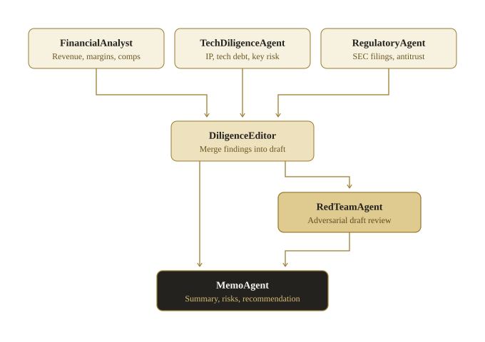

<div align="center">
  

  <p><em>Agent swarms with generated execution topology.</em></p>

  <p>
    <a href="https://pypi.org/project/smythe/"></a>
    <a href="https://github.com/petehottelet/smythe/actions/workflows/ci.yml"></a>
    
    <a href="LICENSE"></a>
  </p>

  <p>
    <a href="#60-second-quickstart">Quickstart</a> ·
    <a href="#why-smythe">Why Smythe</a> ·
    <a href="#architected-planning-beats-fixed-execution-on-efficiency">Evidence</a> ·
    <a href="docs/index.md">Documentation</a>
  </p>
</div>

**Smythe turns a goal into an inspectable execution graph, then runs that graph
in parallel under hard cost, concurrency, verification, trace, and recovery
controls.** The topology is generated for the task instead of hardcoded into
the application.

## 60-second quickstart

```bash
pip install smythe
```

Set `ANTHROPIC_API_KEY`, `OPENAI_API_KEY`, or `GOOGLE_API_KEY`, then choose a
model from that provider in `Swarm(model=...)`. Hand Smythe a goal and planning
returns the generated DAG for inspection before execution starts:

```python
from smythe import Swarm, Task

swarm = Swarm(
    model="claude-opus-4-8",  # or an OpenAI / Gemini model you can access
    max_budget_usd=0.50,
    parallel=True,
    max_concurrency=8,
)

task = Task(
    goal=(
        "Produce a competitive brief on portable solar phone chargers: "
        "market landscape, top competitors, and a one-page summary."
    ),
    constraints=["Keep the final brief under 400 words"],
    done_when=["Every recommendation is supported by the analysis"],
)

graph = swarm.plan(task)
print(graph)                       # inspect or reject the generated DAG

result = swarm.execute(graph)
print(result.output)
print(f"cost: ${result.total_cost_usd:.4f}")
```

No key is required to explore the repository. The examples and benchmark
mechanics run against deterministic offline providers:

```bash
git clone https://github.com/petehottelet/smythe.git
cd smythe
pip install -e ".[dev]"
python examples/acquisition_diligence/run.py
```

## Framework comparison

On a matched suite—five tasks, the same fixed three-stage semantic pipeline,
the same executor model, and a blind cross-vendor judge—Smythe recorded the
highest blind quality, the fewest mean tokens, and the lowest mean wall time
across Smythe, LangGraph, and CrewAI.

<p align="center">
  
</p>

<p align="center">
  
</p>

[Framework protocol and corrected records](benchmarks/README.md#corrected-framework-head-to-head-langgraph-and-crewai-2026-07-12).

## Architected planning beats fixed execution on efficiency

<p align="center">
  
</p>

Across five deliberately different task shapes, Smythe reached the same quality
band as a strong fixed pipeline while using **19% less cost**, **14% less wall
time**, and **20% less cost per quality point**. It used one node for a
one-step transform and 5.3 nodes for the parallel workload—the graph size
changed with the work. [Shape-suite report and raw records](benchmarks/shape_suite.md).

## Artifact fan-out scales from 64 to 256 nodes

<p align="center">
  
</p>

The matched 64-, 128-, 192-, and 256-node partitions each produced a complete
set of valid, unique glyphs at every measured concurrency. Each width has its
own result record and raw-output namespace; the wider comparisons do not alter
the existing 192-character screensaver build.
[Width-scaling protocol and records](benchmarks/glyph_screensaver_benchmark.md#width-scaling-from-64-to-256-nodes).

Every headline number above is rendered from a committed result record. The
[benchmark index](benchmarks/README.md) separates current, claimable evidence
from diagnostic campaigns that found and fixed framework or harness defects.

## Example: Glyph Rain at 192-node fan-out

Glyph Rain demonstrates Smythe's general-purpose execution model on a concrete
visual artifact. A screensaver brief becomes an inspectable 192-node broadcast
graph governed by the same budgets, bounded concurrency, verification, traces,
artifacts, and recovery available to any Smythe workload.

<p align="center">
  
</p>

**Download:** [Windows `.scr`](screensaver/dist/SmytheGlyphRain.scr) ·
[macOS `.saver` build](https://github.com/petehottelet/smythe/actions/workflows/screensavers.yml) ·
[screensaver source](screensaver/) ·
[192-glyph atlas](assets/glyph_rain/glyph-atlas.png) ·
[256-glyph atlas](benchmarks/partitions/glyph_256/assets/glyph-atlas.png)

<p align="center">
  
</p>

<p align="center">
  
</p>

Each node produces one original tile. Every tile is normalized,
dimension-checked, and SHA-256 verified before assembly. The specimen plate
above is drawn directly from the committed vector stroke programs used by the
web, Windows, and macOS ports.

At the published realistic-latency profile, the 192-node example takes **19
minutes at concurrency 1** and **20.5 seconds at concurrency 64**: a measured
**56.2× speedup** with all 192 tiles valid and unique at every concurrency.
[Protocol and records](benchmarks/glyph_screensaver_benchmark.md). On the same
wide-fanout execution pattern, Smythe's per-node recovery re-exposed **8 calls
after a hard kill versus LangGraph's 32**, across three repetitions with the
strongest persistence mode enabled on both sides.
[Durability protocol and records](benchmarks/durability_benchmark.md).

## Why Smythe

Most orchestration frameworks ask the developer to author the graph. Smythe
makes the graph a generated, inspectable artifact and places it inside a
durable execution envelope.

| Capability | What Smythe provides |
|---|---|
| **Generated topology** | Serial, fork-join, broadcast-reduce, and adversarial phases selected for the goal |
| **Inspectable plans** | `plan()` returns the DAG before provider work begins |
| **Right-sized execution** | One node for simple work; parallel specialists only where decomposition earns its cost |
| **Fail-closed budgets** | Per-call reservations prevent a concurrent wave from exceeding the admitted spend ceiling |
| **Durable recovery** | Per-node checkpoints resume completed work instead of restarting the graph |
| **Objective gates** | Deterministic verifiers can enforce dimensions, schema, required sections, or any callable rule |
| **Tool-using agents** | Bounded MCP loops over stdio or HTTP with allowlists, timeouts, traces, and secret-name passthrough |
| **Artifact execution** | Image generation, vision inputs, exact-spec finishing, hashes, and durable job manifests |
| **Learning loop** | Execution outcomes feed planning memory; successful graphs can be distilled into reusable templates |

Three planning tiers let applications choose how much freedom to grant:

| Tier | Class | Use it when |
|---|---|---|
| Deterministic | `DeterministicArchitect` | The workflow is proven and should be pure Python |
| Constrained | `ConstrainedArchitect` | The model should select from approved graph templates |
| Autonomous | `LLMArchitect` | The task needs a bespoke DAG generated from the goal |

The runtime keeps planning, execution, and synthesis separate. A `Sentinel`
admits spend before calls start; the tracer records every node; checkpoint
stores persist progress; supervisors can revise pending work; verifier nodes
can regenerate rejected subtrees; and synthesizers return the graph's intended
deliverable.

[Architecture overview](docs/architecture.md) ·
[checkpoint format](docs/checkpoint-format.md) ·
[verification](docs/verifier.md) ·
[adaptive supervision](docs/supervisor.md)

## Durable artifact jobs

Wide artifact runs also have a manifest-driven operator surface with exact-plan
approval, complete worst-case cost preflight, bounded dispatch, a SQLite
attempt/event journal, conservative unknown outcomes, selective rerolls, and
portable exports:

```bash
pip install "smythe[jobs]"

smythe jobs validate job.yaml
smythe jobs plan job.yaml --max-spend-usd 0.64
smythe jobs run job.yaml --approve approve_v1_... --max-spend-usd 0.64
smythe jobs status RUN_ID --events
smythe jobs reroll RUN_ID "tile[17]" --reason "failed visual review"
smythe jobs export RUN_ID --out run-export.json
```

[Jobs guide and manifest reference](docs/jobs.md).

## Example: acquisition diligence

The acquisition-diligence demo turns one goal into a
`fork-join → adversarial → serial` graph: three specialists run in parallel, an
editor combines their findings, a red team attacks the draft, and a final memo
node produces the decision.

<p align="center">
  
</p>

```bash
python examples/acquisition_diligence/run.py
```

The expected graph, trace, and memo are committed and regenerated in CI.
[Walk through the demo](examples/acquisition_diligence/).

## Installation

Python 3.11+ is supported.

| Install | Includes |
|---|---|
| `pip install smythe` | Core graph, planning, execution, budget, trace, and offline provider |
| `pip install "smythe[anthropic]"` | Anthropic provider |
| `pip install "smythe[openai]"` | OpenAI and OpenAI-compatible providers |
| `pip install "smythe[gemini]"` | Google Gemini provider |
| `pip install "smythe[mcp]"` | MCP tool runtime |
| `pip install "smythe[jobs]"` | Durable artifact jobs and image inspection |
| `pip install "smythe[all]"` | Every runtime integration |
| `pip install "smythe[benchmarks]"` | Reproducible benchmark harnesses |

## Documentation

- [Documentation index](docs/index.md) — start here for the complete map
- [Architecture](docs/architecture.md) — generated graphs and the durable execution envelope
- [Jobs](docs/jobs.md) — manifests, approvals, attempts, recovery, and exports
- [MCP](docs/mcp.md) — tool servers, policy, secrets, and the bounded loop
- [Checkpoint format](docs/checkpoint-format.md) — persistence and resume semantics
- [Verification](docs/verifier.md) — deterministic and model-based gates
- [Adaptive supervision](docs/supervisor.md) — revising pending work from completed results
- [Optimization](docs/optimize.md) — bounded, evidence-backed concurrency autotuning
- [Examples](examples/README.md) — runnable feature tours
- [Benchmarks](benchmarks/README.md) — protocols, evidence status, and raw records
- [Roadmap](ROADMAP.md) — shipped work and next milestones

## Project status

Smythe is pre-1.0 and actively developed. The current branch includes a
192-node artifact example, an isolated 256-node comparison, checkpoint format
v2, declarative verification gates, bounded supervision, durable Jobs, and
deterministic README charts.
Release history and compatibility policy live in [CHANGELOG.md](CHANGELOG.md).

Contributions are welcome through [CONTRIBUTING.md](CONTRIBUTING.md). Security
reports follow [SECURITY.md](SECURITY.md).

## License

MIT
