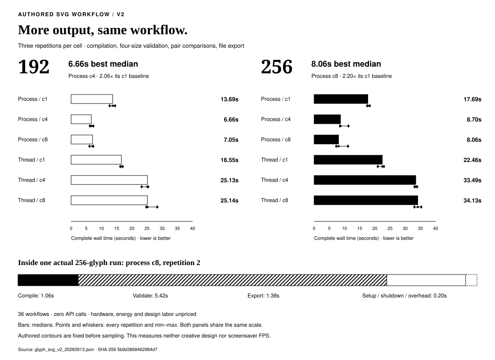
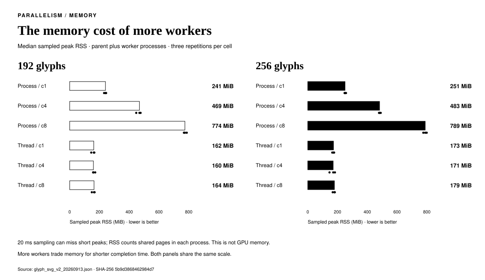
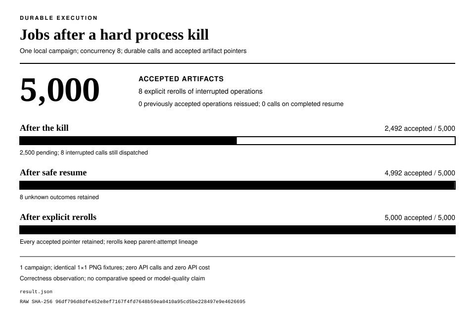

<div align="center">
  
  <p><em>An open-source framework for task-based agent swarms with dynamic parallelization, routing, and execution topology.</em></p>
  <p>
    <a href="https://pypi.org/project/smythe/"></a>
    <a href="https://github.com/petehottelet/smythe/actions/workflows/ci.yml?query=branch%3Amain+event%3Apush"></a>
    
    <a href="LICENSE"></a>
  </p>
  <p>
    <a href="#quickstart">Quickstart</a> ·
    <a href="#how-it-works">How it works</a> ·
    <a href="#measured-results">Measured results</a> ·
    <a href="docs/index.md">Documentation</a>
  </p>
</div>

**Smythe is a Python framework that plans and runs agent workflows.** Give it a
goal, inspect the generated task graph, and execute independent work in parallel.
Set spending and concurrency limits, verify outputs, and recover saved work after
an interruption.

Use it for research pipelines, document production, and artifact generation
where you need to see what will run and account for what happened.

<p align="center">
  
</p>
<p align="center"><em><a href="screensaver/README.md">Glyph Rain</a> is Smythe's parallel-processing example: each glyph is an independent task, and Smythe runs the tasks concurrently.</em></p>

Example Task: Smythe generated **192 glyphs in 20.5 seconds, 56.2× faster than serial.** Smythe runs the glyph
set as one 192-node fan-out graph, one node per glyph, with up to 64 nodes; run one node at a time, the same graph took 1,149.6 seconds. Controlled offline run with fixed latency per call measures Smythe's scheduling. Glyphs are compiled, validated, and exported in parallel: 256 SVG glyphs in 8.06 seconds
median with eight process workers, 2.20× faster than one worker, with no API calls. [Fan-out benchmark](benchmarks/glyph_screensaver_benchmark.md) ·
[SVG workflow benchmark](benchmarks/svg_v2_results.md)

<p align="center">
  <a href="screensaver/glyph-design-v2/contact-sheet-128.png">192-glyph sheet</a> ·
  <a href="benchmarks/partitions/glyph_svg_v2_256/catalog/contact-sheet-128.png">256-glyph sheet</a> ·
  <a href="screensaver/glyph-design-v2/README.md">Individual SVGs</a> ·
  <a href="screensaver/svg-preview/README.md">Web explorer</a> ·
  <a href="docs/current-materials.md">All materials</a>
</p>

## Quickstart

Python 3.11+:

```bash
pip install smythe
```

Plan, run, and recover a workflow with no API key:

```python
from smythe import OfflineProvider, SQLiteWorkflowStore, Swarm, Task

# The plan a model would generate. OfflineProvider returns it to the planner
# and echoes each step, so everything below runs without an API key.
plan = {
    "topology": ["fork_join"],
    "nodes": [
        {"id": "sqlite", "label": "Assess SQLite"},
        {"id": "postgres", "label": "Assess PostgreSQL"},
        {"id": "duckdb", "label": "Assess DuckDB"},
        {"id": "pick", "label": "Recommend one database",
         "depends_on": ["sqlite", "postgres", "duckdb"]},
    ],
}

with SQLiteWorkflowStore("smythe-runs.db") as store:
    swarm = Swarm(
        provider=OfflineProvider(plan=plan),
        run_store=store,
        max_budget_usd=1.00,
        parallel=True,
    )
    graph = swarm.plan(Task("Compare SQLite, PostgreSQL, and DuckDB for a local analytics app."))
    print(graph)  # inspect the generated graph before anything runs

    result = swarm.execute(graph)
    print(result.output)

    replay = swarm.resume(result.execution_id)  # replayed from the journal, no new calls
    print(replay.output == result.output)
```

`print(graph)` shows the graph before anything runs:

```text
TaskGraph(topology="fork-join")
├─ fork (parallel):
│   ├─ agent-sqlite: Assess SQLite
│   ├─ agent-postgres: Assess PostgreSQL
│   └─ agent-duckdb: Assess DuckDB
└─ join: agent-pick: Recommend one database
```

The three assessments run in parallel under the $1 budget, and the SQLite
journal records every call, so `resume` returns the finished run without
calling the provider again.

### With a real model

Install a provider extra, set `OPENAI_API_KEY`, and let
[GPT-6 Astra](https://developers.openai.com/api/docs/models/gpt-6-astra)
write the plan and the answers:

```bash
pip install "smythe[openai]"
```

```python
from smythe import OpenAIResponsesProvider, SQLiteWorkflowStore, Swarm, Task

with SQLiteWorkflowStore("smythe-runs.db") as store:
    swarm = Swarm(
        model="gpt-6-astra",
        provider=OpenAIResponsesProvider(
            reasoning_effort="medium",
            max_output_tokens=8192,
        ),
        run_store=store,
        max_budget_usd=5.00,
        parallel=True,
        max_concurrency=8,
    )
    graph = swarm.plan(Task(
        goal="Compare SQLite, PostgreSQL, and DuckDB for a local analytics app.",
        constraints=["Stay under 400 words", "Recommend one database"],
    ))
    print(graph)
    result = swarm.execute(graph)
    print(result.output)
```

This makes paid API calls under a **$5 run allowance**. The SQLite ledger
accounts for planning and execution, reserves requests before dispatch, and
retains responses for recovery. See [budget scope](docs/budgets.md) and
[durable text workflows](docs/workflow-accounting.md). Claude and Gemini
install the same way, with `smythe[anthropic]` and `smythe[gemini]`; durable run
stores accept the OpenAI Responses and Claude Messages providers.
[More examples](examples/README.md).

## How it works

**The graph defines the work.** Smythe generates a directed acyclic graph for
the task, including dependencies and agent assignments. Inspect or export it
before execution. Use approved templates or a graph you write yourself when
the workflow is already known.

**The execution envelope governs the run.** Budgets, bounded concurrency,
verification, traces, artifacts, and recovery apply as the graph executes.
Durable Jobs add manifest approval, attempt history, selective rerolls, and
local HTML reports.

<p align="center">
  
</p>

The [acquisition-diligence example](examples/acquisition_diligence/) shows
three specialists feeding an editor, a red-team review, and a final decision
memo. Its saved graph, trace, and expected output make the workflow inspectable.

| You need to… | Smythe provides |
|---|---|
| Adapt the workflow to the task | Generated graphs, approved templates, and deterministic planning |
| Control spending and parallel work | Request reservations and bounded concurrency |
| Recover interrupted work | Checkpoints, native response replay, and durable job journals |
| Check the deliverable | Output verification and artifact receipts |
| Understand a run | Graph exports, traces, costs, and inspection reports |

[Architecture](docs/architecture.md) · [Execution](docs/execution.md) ·
[Jobs](docs/jobs.md) · [Verification](docs/verifier.md) · [MCP tools](docs/mcp.md).

## Measured results

Each result links to its protocol and retained records. Charts are generated
from the committed records.

| Study | Recorded result | Scope |
|---|---|---|
| [Framework comparison](benchmarks/README.md#corrected-framework-head-to-head-langgraph-and-crewai-2026-07-12) | 77% fewer mean tokens and 28% less mean wall time than CrewAI | Five tasks, three repetitions; matched executor and fixed pipeline; blind judging |
| [Interruption and recovery](benchmarks/durability_benchmark.md) | 8 repeated dispatches versus LangGraph's 32 | Three matched hard-kill trials with 64 operations |
| [Generated topology](benchmarks/shape_suite.md) | 14% less wall time than a fixed pipeline, planning included | Five task shapes, three repetitions; wall time and observed quality |
| [SVG catalog workflow](benchmarks/svg_v2_results.md) | 256 SVGs in 8.06 seconds median; 2.20× the serial baseline | Local compilation, validation, and export of authored designs; no API calls |
| [Glyph generation at scale](benchmarks/glyph_screensaver_benchmark.md) | 56.2× faster than serial at concurrency 64 | Controlled offline runs at 64 to 256 nodes; simulated provider latency |
| [Jobs at 5,000 operations](benchmarks/jobs_scale_5000_20260907_results.md) | 5,000 accepted artifacts after a hard kill and recovery | One offline campaign with identical fixtures; correctness, not speed |

### Framework efficiency

On a fixed three-stage pipeline, Smythe used **77% fewer tokens and 28% less
wall time than CrewAI** across five tasks and three repetitions per framework,
with the same executor model and blind cross-vendor judging. It also recorded
6% less mean wall time than LangGraph, and the highest observed quality score:
9.73/10, versus 9.53 for both. Token counts describe model usage, not invoice
savings.

<p align="center">
  
</p>

<p align="center">
  
</p>

### Recovery after interruption

After a hard kill, Smythe repeated **8 calls versus LangGraph's 32**, a 75%
reduction, in each of three matched repetitions. Both finished all 64
operations. [Recovery protocol](benchmarks/durability_benchmark.md).

<p align="center">
  
</p>

### Generated execution topology

Across five task shapes, generated plans took **14% less wall time than a fixed
pipeline, planning included**. They used one node for a simple transformation
and 5.3 on average for parallel research. Observed quality averaged 9.47/10
versus 9.33/10, within measured judge variation.
[Task-shape protocol and records](benchmarks/shape_suite.md).

<p align="center">
  
</p>

The [200-workflow Astra/Sol study](benchmarks/astra_findings.md)
also reports the limits of generated plans: they increased mean time in both
models on its ten synthetic tasks. The frozen rule accepted 191/200 workflows;
human review accepted all eight disputed available answers. One missing usage
receipt limits affected exact cost comparisons. All outcomes remain published.

### Parallel artifact generation

Smythe compiles, validates at four sizes, compares every pair, and exports
**256 SVG glyphs in 8.06 seconds median**, **2.20× faster** than its
concurrency-one baseline with eight process workers. All 36 workflows pass with
identical SVG and pixel hashes across repetitions, with zero API calls.
[Results and scope](benchmarks/svg_v2_results.md).

<p align="center">
  
</p>

Process workers trade more memory for shorter completion time:

<p align="center">
  
</p>

At concurrency 64, generating 192 glyphs took **20.5 seconds** versus 1,149.6
seconds serially, **56.2× faster**, and all 192 validated as unique. This is a
controlled offline measurement with 5.8 seconds of simulated provider latency
per call; every 64-, 128-, 192- and 256-node run produced complete sets of
valid, unique tiles. [Glyph protocol and records](benchmarks/glyph_screensaver_benchmark.md).

<p align="center">
  
</p>

### Jobs at 5,000 operations

A durable Jobs campaign was killed mid-run and recovered to **5,000 accepted
artifacts**. Safe resume preserved the 2,492 outputs already accepted and
reissued none of them; eight interrupted operations needed explicit rerolls,
and resuming the completed job made zero new calls. One offline campaign with
identical fixtures, so this shows recovery correctness, not speed.
[Results and independent reconciliation](benchmarks/jobs_scale_5000_20260907_results.md).

<p align="center">
  
</p>

[All benchmarks, charts, and evidence status](benchmarks/README.md).

## Project status

**Smythe 0.8.1** is the current library release. See the
[release notes and upgrade guide](docs/release-0.8.1.md). The API is pre-1.0;
minor releases may change it. Later source changes appear in the
[changelog](CHANGELOG.md#unreleased).

Next priorities are complete-deliverable checks, broader external-task
benchmarks, and separately controlled Astra scheduler and framework studies.
See the [roadmap](ROADMAP.md) for status and acceptance criteria.

The [Glyph Rain screensaver](screensaver/README.md) is an artifact-generation
showcase with source builds and a [web explorer](screensaver/svg-preview/README.md).
Precompiled screensaver distribution is paused.

[Documentation](docs/index.md) · [Contributing](CONTRIBUTING.md) ·
[Releases](https://github.com/petehottelet/smythe/releases) ·
[Security](SECURITY.md) · [MIT license](LICENSE).
