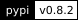
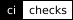
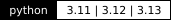
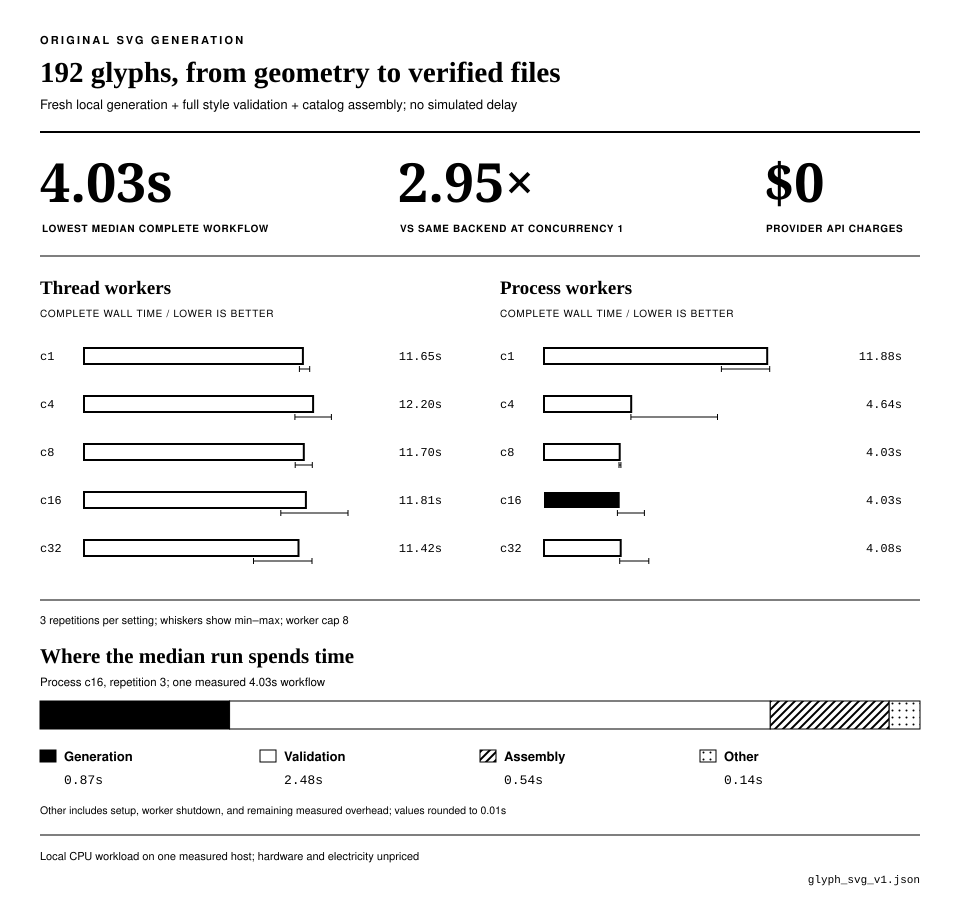
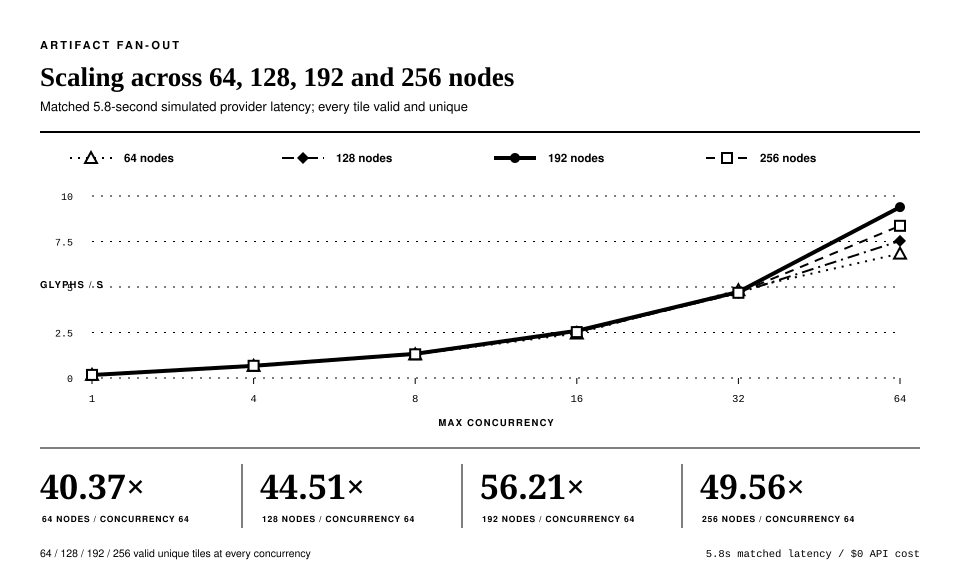
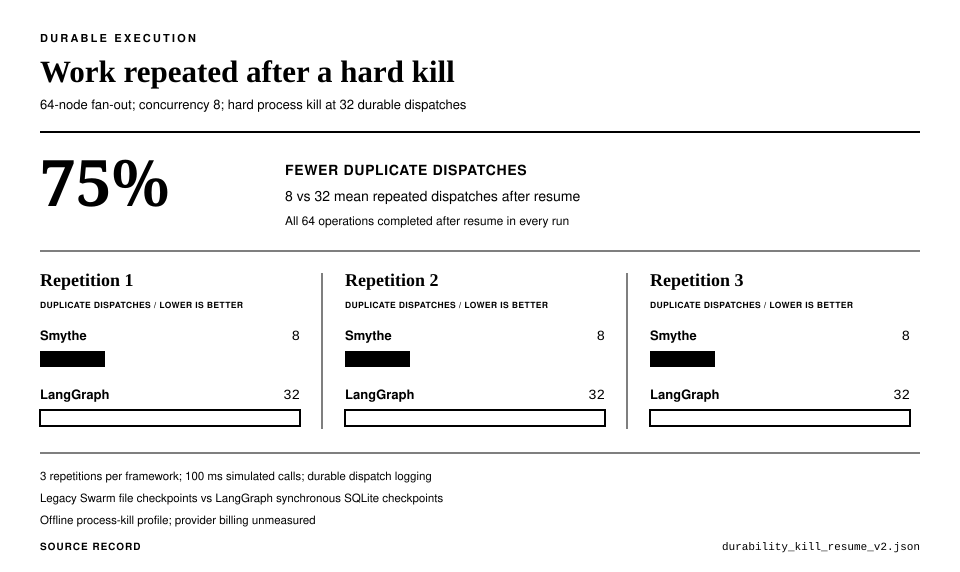
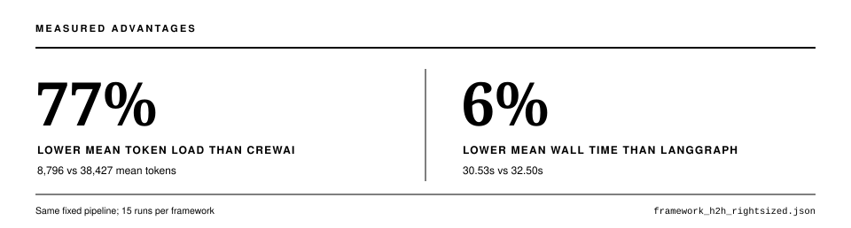
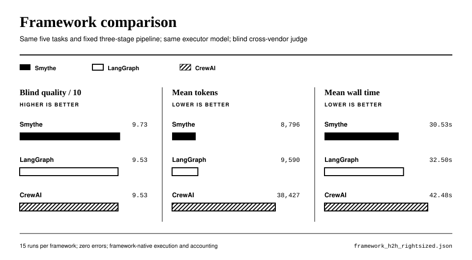
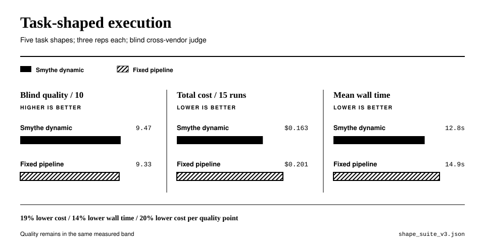

<div align="center">
  

  <p><em>task-based agent swarms with dynamic parallelization, routing, and execution topology.</em></p>

  <p>
    <a href="https://pypi.org/project/smythe/"></a>
    <a href="https://github.com/petehottelet/smythe/actions/workflows/ci.yml"></a>
    
    <a href="LICENSE"></a>
  </p>

  <p>
    <a href="#glyph-rain">Glyph Rain</a> ·
    <a href="#benchmarks">Benchmarks</a> ·
    <a href="#quickstart">Quickstart</a> ·
    <a href="#why-smythe">Why Smythe</a> ·
    <a href="docs/index.md">Documentation</a>
  </p>
</div>

**Give Smythe a goal. It generates an inspectable task graph and executes it
with bounded concurrency, execution budgets, verification, traces, and recovery.** The graph defines the work; the durable execution envelope governs the run.

**Measured against CrewAI on the matched framework suite: 77% fewer tokens
and 28% less wall time.** Five tasks, three repetitions, the same executor
model and pipeline, with blind cross-vendor judging.

## Glyph Rain

One artifact workflow creates 192 original SVG glyphs and validates every
shape. The explorer mixes them into the reference character set: classic
code rain, with occasional new characters and a navigable 3D mode.

<p align="center">
  
</p>

**Explore:** [Run the web explorer](screensaver/svg-preview/README.md) ·
[Complete 192-glyph contact sheet](benchmarks/partitions/glyph_svg_v1/catalog/contact-sheet.png) ·
[56 reference glyphs](screensaver/svg-preview/reference/contact-sheet.png) ·
[24-glyph calibration sheet](benchmarks/partitions/glyph_svg_v1/catalog/calibration-sheet.png) ·
[Individual SVGs and manifest](benchmarks/partitions/glyph_svg_v1/catalog/).
Settings includes Classic, Operator, and 3D presets, glyph mix, motion, glow,
and color controls. VT323 pixel controls and a Trajan Bold outline logo use bright
green on black. The rain keeps its Matrix green grade and mint highlights.
The default mix is 10% original glyphs. In 3D mode, arrow
keys move through the field; Space pauses, R resets the view, and F enters
fullscreen. Touch controls are included.

**Native downloads:** [Windows `.scr`](https://github.com/petehottelet/smythe/raw/refs/heads/main/screensaver/dist/SmytheGlyphRain.scr) ·
[macOS universal `.zip`](https://github.com/petehottelet/smythe/raw/refs/heads/main/screensaver/dist/GlyphRain-macos-universal.zip) ·
[Linux x86-64 `.tar.gz`](https://github.com/petehottelet/smythe/raw/refs/heads/main/screensaver/dist/SmytheGlyphRain-linux-x86_64.tar.gz) ·
[Native source and setup](screensaver/README.md).

These binaries use the earlier [stroke catalog](assets/glyph_rain/glyph-atlas.png).
They passed native rendering and motion checks on Windows,
Apple Silicon, Intel Mac, and Ubuntu 22.04/24.04.
[Checksums and verification](screensaver/README.md#native-verification).
macOS uses an ad-hoc signature; Linux requires X11.

The web renderer adapts [m8e](https://github.com/m8e/matrix-rain),
a fork of Rezmason, under its MIT license. It uses the reference's rain,
glyph rendering, bloom, and palette pipeline. Smythe's 192 added shapes have
independently authored contours from a [measured style brief](docs/glyph-rain-plan.md).
[Credits, licenses, and artwork provenance](screensaver/README.md#credits-and-references).

## Benchmarks

The glyph workload measures parallel artifact generation. Separate matched
suites measure recovery, framework overhead, and generated plans. Each result
links to its protocol and committed records.

### Original SVG generation

**192 original SVG glyphs in 4.03 seconds median**, including generation,
complete validation, and assembly. The best tested configuration used eight
process workers and ran **2.95× faster** than process execution at concurrency 1.
All 30 workflows delivered complete, accepted catalogs with identical hashes.

The new workflow measures fresh contour construction, full style and
distinctness checks, and delivery of the SVG catalog and raster atlas.
It runs locally through Smythe from a calibrated procedural grammar, with no
simulated delay and **$0 provider API charges**. Hardware and design work are
outside that API-cost figure.

<p align="center">
  
</p>

[Workflow results and protocol](benchmarks/svg_glyph_benchmark.md) ·
[Raw record](benchmarks/results/glyph_svg_v1.json).

### Glyph generation and scaling

**192 verified glyphs in 20.5 seconds.** At concurrency 64, the glyph workload
ran **56.2× faster** than serial execution. This is a controlled offline
measurement with 5.8 seconds of simulated provider latency per call.
All measured 64-, 128-, 192-, and 256-node runs produced complete sets of valid,
unique tiles. This measures artifact generation, not screensaver frame rate.

<p align="center">
  
</p>

[Glyph protocol and records](benchmarks/glyph_screensaver_benchmark.md).

### Recovery after interruption

A separate matched durability test measures work repeated after a hard kill.
Smythe repeated **8 calls versus LangGraph's 32**, a **75% reduction**, across
three repetitions. [Recovery protocol](benchmarks/durability_benchmark.md).

<p align="center">
  
</p>

### Framework efficiency

The framework suite compares orchestration on a fixed pipeline. Smythe used
**77% fewer tokens and 28% less wall time than CrewAI** across five tasks and
three repetitions per framework. All runs use the same executor model and
three-stage pipeline, with blind cross-vendor judging.

<p align="center">
  
</p>

<p align="center">
  
</p>

Smythe also recorded **6% less mean wall time than LangGraph**. Its observed
quality score was **9.73/10**, versus 9.53 for both comparisons. These are
suite results; token counts describe model usage, not invoice savings.
[Protocol and records](benchmarks/README.md#corrected-framework-head-to-head-langgraph-and-crewai-2026-07-12).

### Generated execution topology

The task-shape suite compares generated plans with a fixed pipeline across
five task shapes. Smythe recorded **14% less wall time**, including planning.
It used one node for a simple transformation and an average of 5.3 for parallel
research. Observed quality averaged 9.47/10 versus 9.33/10, within measured
judge variation.

<p align="center">
  
</p>

[Task-shape protocol and records](benchmarks/shape_suite.md).

Charts are generated from committed records. The [benchmark index](benchmarks/README.md)
documents each comparison, its scope, and its evidence status.

## Why Smythe

| Generated execution topology | Durable execution envelope |
|---|---|
| Generate a DAG from the goal with `LLMArchitect` | Bound active calls with `max_concurrency` |
| Select approved templates with `ConstrainedArchitect` | Reserve execution spend before dispatch |
| Build exact workflows with `DeterministicArchitect` | Save node results and resume from checkpoints |
| Inspect and export plans before execution | Validate artifacts and gate results |
| Reuse successful graphs as templates | Trace calls, costs, failures, and revisions |

Agents use MCP tools, generate images, and pass artifacts to downstream nodes.
Durable Jobs add manifest validation, plan approvals, an attempt journal,
selective rerolls, and portable exports.

[Architecture](docs/architecture.md) · [Jobs and CLI](docs/jobs.md) ·
[MCP](docs/mcp.md) · [Verification](docs/verifier.md) ·
[All guides and examples](docs/index.md).

## Quickstart

Python 3.11+. Install the provider used below:

```bash
pip install "smythe[openai]"
```

Set `OPENAI_API_KEY`, then generate and inspect a text-only plan with
[GPT-6 Astra](https://developers.openai.com/api/docs/models/gpt-6-astra):

```python
from smythe import Swarm, Task

swarm = Swarm(
    model="gpt-6-astra",
    parallel=True,
    max_concurrency=8,
)

task = Task(
    goal="Compare SQLite, PostgreSQL, and DuckDB for a local analytics app.",
    constraints=[
        "Keep the comparison under 400 words",
        "Explain the tradeoffs and recommend one database",
    ],
)

graph = swarm.plan(task)
print(graph)

result = swarm.execute(graph)
print(result.output)
```

This example makes paid API calls without a spend cap. Text-provider dollar
totals currently use a blended token estimate and exclude planning;
`max_budget_usd` is not an Astra invoice ceiling. Model-specific accounting
and Astra tool support are specified in the [campaign plan](benchmarks/astra_benchmark_plan.md).
Anthropic and Gemini use the `smythe[anthropic]` and `smythe[gemini]` extras.

Try the complete acquisition-diligence workflow without an API key:

```bash
git clone https://github.com/petehottelet/smythe.git
cd smythe
pip install -e ".[dev]"
python examples/acquisition_diligence/run.py
```

Three specialists work in parallel, an editor assembles their findings, a red
team challenges the draft, and a final node writes the decision memo.
[Graph, trace, and expected output](examples/acquisition_diligence/).

## Coming soon

- **Complete workflow cost accounting:** include planning and supervision in
  one spend ledger, then publish repeated cost comparisons from native usage.
- **Runtime hardening:** synchronize verification with active descendants,
  enforce serial halt behavior, reject invalid cost inputs, and carry the full
  task context through planning, execution, and resume.
- **Operator tools:** inspect runs, detach long jobs, and approve durable pauses.
- **Native SVG exploration:** port the new catalog and camera controls to
  Windows, macOS, and Linux, then verify every compiled target against the
  [implementation plan](docs/glyph-rain-plan.md).
- **Native distribution:** notarized macOS downloads and native Wayland integration.
- **Renderer performance:** meet the 1080p frame-interval target with the new
  glyphs. [Renderer checks and measurement scope](screensaver/svg-preview/README.md#renderer-and-checks).
- **Broader evidence:** larger stress tests, repeated live glyph sweeps, and
  human-calibrated quality comparisons with saved outputs and judge reasoning.
- **Astra benchmarks:** matched model and orchestration comparisons with full
  usage accounting, repeated runs, and blind quality scoring. See the
  [campaign plan](benchmarks/astra_benchmark_plan.md).

[Specifications and priorities](ROADMAP.md#coming-soon) ·
[Repository review](docs/project-review-2026-09-06.md).

Smythe is pre-1.0; minor releases may change APIs.
[Release history](CHANGELOG.md) · [Contributing](CONTRIBUTING.md) ·
[Security](SECURITY.md) · [MIT license](LICENSE).
