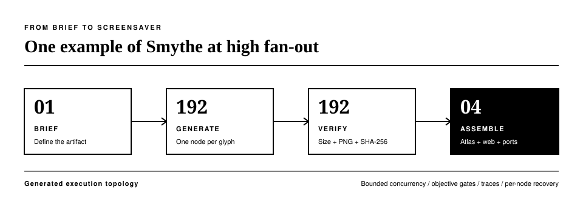
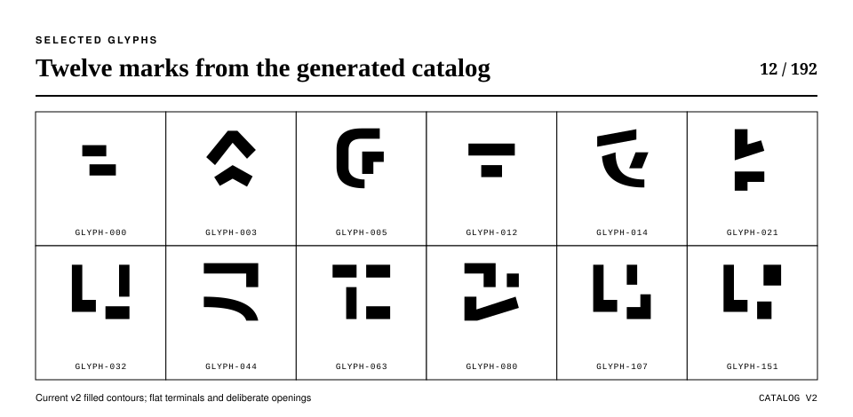

<div align="center">
  

  <p><em>Generated execution graphs. Durable agent swarms.</em></p>

  <p>
    <a href="https://pypi.org/project/smythe/"></a>
    <a href="https://github.com/petehottelet/smythe/actions/workflows/ci.yml"></a>
    
    <a href="LICENSE"></a>
  </p>

  <p>
    <a href="#benchmarks">Benchmarks</a> ·
    <a href="#quickstart">Quickstart</a> ·
    <a href="#why-smythe">Why Smythe</a> ·
    <a href="docs/index.md">Documentation</a>
  </p>
</div>

**Give Smythe a goal. It generates an inspectable task graph and executes it
with bounded concurrency, execution budgets, verification, traces, and recovery.**

The graph defines the work. The durable execution envelope governs how it runs.
Inspect the plan, run independent nodes in parallel, and resume from saved progress.

## Benchmarks

**77% fewer tokens. 28% less wall time.** Smythe versus CrewAI on the matched
framework suite: five tasks, three repetitions, the same executor model and
three-stage pipeline, with blind cross-vendor judging.

<p align="center">
  
</p>

<p align="center">
  
</p>

Smythe also recorded **6% less mean wall time than LangGraph**. Its observed
quality score was **9.73/10**, versus 9.53 for both comparisons. These are
suite results; token counts describe model usage, not invoice savings.
[Protocol and records](benchmarks/README.md#corrected-framework-head-to-head-langgraph-and-crewai-2026-07-12).

## Generated plans, measured

**14% less wall time than a fixed pipeline** across five task shapes. Smythe
used one node for a simple transformation and an average of 5.3 for parallel
research. Observed quality averaged 9.47/10 versus 9.33/10, within measured
judge variation.

<p align="center">
  
</p>

[Task-shape protocol and records](benchmarks/shape_suite.md).

## Artifact fan-out

**192 verified glyphs in 20.5 seconds.** At concurrency 64, the glyph workload
ran **56.2× faster** than serial execution. This is a controlled offline
measurement with 5.8 seconds of simulated provider latency per call.
All measured 64-, 128-, 192-, and 256-node runs produced complete sets of valid,
unique tiles.

<p align="center">
  
</p>

Recovery matters at this scale: after a hard kill, Smythe repeated **8 calls
versus LangGraph's 32**, a **75% reduction**, across three repetitions of the
matched durability workload.
[Glyph protocol](benchmarks/glyph_screensaver_benchmark.md) ·
[Recovery protocol](benchmarks/durability_benchmark.md).

Charts are generated from committed records. The [benchmark index](benchmarks/README.md)
documents each comparison, its scope, and its evidence status.

## Quickstart

Python 3.11+. Install the provider used below:

```bash
pip install "smythe[openai]"
```

Set `OPENAI_API_KEY`, then generate and inspect a plan:

```python
from smythe import Swarm, Task

swarm = Swarm(
    model="gpt-5.4-mini",
    max_budget_usd=0.50,
    parallel=True,
    max_concurrency=8,
)

task = Task(
    goal="Compare SQLite, PostgreSQL, and DuckDB for a local analytics app.",
    constraints=["Keep the comparison under 400 words"],
    done_when=["Explain the tradeoffs and recommend one database"],
)

graph = swarm.plan(task)
print(graph)

result = swarm.execute(graph)
print(result.output)
print(f"execution cost: ${result.total_cost_usd:.4f}")
```

The budget covers execution and synthesis; planning calls are separate.
Anthropic and Gemini use the `smythe[anthropic]` and `smythe[gemini]` extras.

Try the complete acquisition-diligence workflow without an API key:

```bash
git clone https://github.com/petehottelet/smythe.git
cd smythe
pip install -e ".[dev]"
python examples/acquisition_diligence/run.py
```

Three specialists work in parallel, an editor assembles their findings, a red
team challenges the draft, and a final node writes the decision memo.
[Graph, trace, and expected output](examples/acquisition_diligence/).

## Why Smythe

| Generated execution topology | Durable execution envelope |
|---|---|
| Generate a DAG from the goal with `LLMArchitect` | Bound active calls with `max_concurrency` |
| Select approved templates with `ConstrainedArchitect` | Reserve execution spend before dispatch |
| Build exact workflows with `DeterministicArchitect` | Save node results and resume from checkpoints |
| Inspect and export plans before execution | Validate artifacts and gate results |
| Reuse successful graphs as templates | Trace calls, costs, failures, and revisions |

Agents use MCP tools, generate images, and pass artifacts to downstream nodes.
Durable Jobs add manifest validation, plan approvals, an attempt journal,
selective rerolls, and portable exports.

[Architecture](docs/architecture.md) · [Jobs and CLI](docs/jobs.md) ·
[MCP](docs/mcp.md) · [Verification](docs/verifier.md) ·
[All guides and examples](docs/index.md).

## Glyph Rain

A 192-node artifact workflow becomes a screensaver: original glyphs, heavy
luminous strokes, green cores, and descending trails across three depth layers.
The web, Windows, macOS, and Linux ports share the same vector catalog.

<p align="center">
  
</p>

**Download:** [Windows `.scr`](screensaver/dist/SmytheGlyphRain.scr) ·
[macOS build](https://github.com/petehottelet/smythe/actions/workflows/screensavers.yml) ·
[Linux build](https://github.com/petehottelet/smythe/actions/workflows/screensavers.yml) ·
[Web and native source](screensaver/) ·
[192-glyph atlas](assets/glyph_rain/glyph-atlas.png) ·
[256-glyph atlas](benchmarks/partitions/glyph_256/assets/glyph-atlas.png)

<p align="center">
  
</p>

<p align="center">
  
</p>

Each generated tile is normalized, checked for dimensions and uniqueness, and
hashed before assembly. [Run, build, and customize Glyph Rain](screensaver/README.md).

## Coming soon

- **Complete workflow cost accounting:** include planning and supervision in
  one spend ledger, then publish repeated cost comparisons from native usage.
- **Runtime hardening:** synchronize verification with active descendants,
  enforce serial halt behavior, reject invalid cost inputs, and carry the full
  task context through planning, execution, and resume.
- **Operator tools:** inspect runs, detach long jobs, and approve durable pauses.
- **Native distribution:** notarized macOS downloads and native Wayland integration.
- **Broader evidence:** larger stress tests, repeated live glyph sweeps, and
  human-calibrated quality comparisons with saved outputs and judge reasoning.

[Specifications and priorities](ROADMAP.md#coming-soon) ·
[Repository review](docs/project-review-2026-09-06.md).

Smythe is pre-1.0; minor releases may change APIs.
[Release history](CHANGELOG.md) · [Contributing](CONTRIBUTING.md) ·
[Security](SECURITY.md) · [MIT license](LICENSE).
