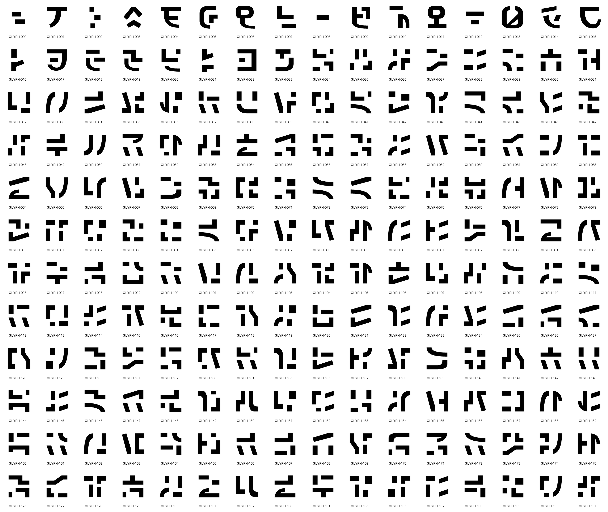

# Noumenon glyph catalog v2

**192 original SVG glyphs.** Current sheets and the
[Noumenon screensaver](https://github.com/petehottelet/noumenon)'s web effect and native source exports use
this catalog. The README animation shows only these new originals; the live
reference mix remains adjustable in Noumenon.

[All current sheets, previews, and benchmark reports](../../../docs/current-materials.md).



[Full-resolution sheet](contact-sheet-128.png) ·
[16 px](contact-sheet-16.png) · [32 px](contact-sheet-32.png) ·
[64 px](contact-sheet-64.png) · [Individual SVGs and hashes](manifest.json).

For closer inspection: [000–047](sheet-1.png) · [048–095](sheet-2.png) ·
[096–143](sheet-3.png) · [144–191](sheet-4.png).
Small-size sheets enlarge the native raster with nearest-neighbor sampling.

The outlines use broad strokes, straight terminal cuts, controlled curves,
and deliberate gaps. Glyph 017 retains the approved separate center bar.
The remaining forms extend the revised writing vocabulary with distinct
stroke arrangements; no circular punches or incidental chips are added.

[Design rules and review](../../../docs/glyph-contour-review-2026-09-12.md) ·
[Measurements](measurements.json). The review record and browser checks are in
the [evidence archive](../../archive/README.md).

## Reproduce

Install the repository's glyph dependencies, then generate into a new folder:

```powershell
pip install -e ".[glyphs]"
python benchmarks/noumenon/glyph_design_v2.py --out smythe/tmp/my-glyph-catalog
```

The generator writes 192 SVGs, the manifest, browser data, the full contact
sheet, four detail sheets, and 16/32/64/128 px inspection sheets. It refuses
to overwrite an existing output folder.

The [current 192/256-glyph benchmark](../../svg_v2_results.md) measures
compilation, validation and export through Smythe. The 256-glyph extension
preserves these 192 SVGs exactly. Design work happens before timing. The
[v1 benchmark](../../svg_glyph_benchmark.md) remains historical.

## Reference credit

The style research examined m8e/matrix-rain and Rezmason/matrix. Noumenon's
live effect retains their licensed base characters separately; this gallery
shows only Smythe's new originals. See the
[MIT notice](https://github.com/petehottelet/noumenon/blob/main/svg-preview/reference/LICENSE) and
[artwork provenance](https://github.com/petehottelet/noumenon/blob/main/svg-preview/reference/README.md).
Reference paths are not inputs to the new glyph generator.
