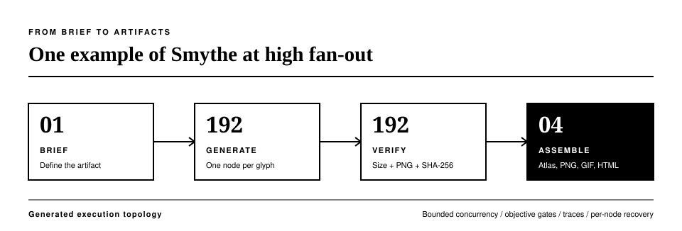
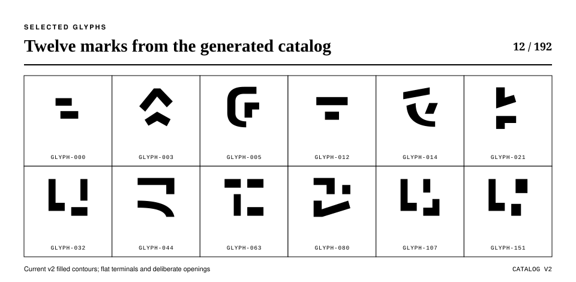
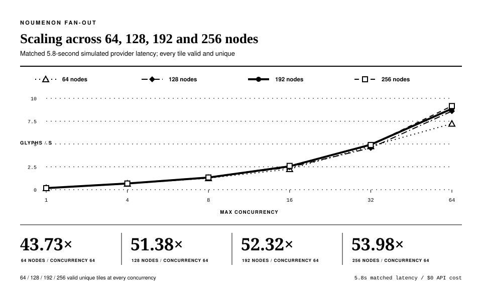

# Noumenon Fan-Out Benchmark

Noumenon is Smythe's parallel-processing example. Each glyph is an independent
task: 192 fictional cyber glyphs are generated as one 192-node
`BROADCAST_REDUCE` graph, validated objectively, and assembled into an atlas, a
still preview, a looping GIF and an HTML page. Smythe runs the tasks
concurrently under a budget, bounded concurrency and per-node recovery.



The offline marks come from an original deterministic stroke grammar:
horizontal bars, vertical stems, hooks, enclosures, press diagonals, bowls,
tail sweeps and diacritic dots composed on an ideograph grid with occasional
serif nubs. They are reminiscent of hand-drawn ideographs and romanesque
letterforms without reproducing any real character; nothing is extracted from
a font, logo, screenshot, film frame or other source image.

The [Noumenon screensaver](https://github.com/petehottelet/noumenon) renders
the separate 192-glyph v2 contour [catalog](noumenon/catalog/README.md), which
the [SVG workflow benchmark](svg_v2_results.md) compiles, validates and exports.



## Results

**Evidence status: claimable.** The 2026-09-25 campaign re-measured every width
under the protocol below. All four records name source revision `097122b` with
no tracked file changed (`dirty: false`), on Python 3.12.10 and Windows 11.

### Width scaling from 64 to 256 nodes

Four isolated partitions measure the same deterministic provider, 5.8-second
simulated call latency, and concurrency sweep at different graph widths. No
result or artifact namespace is shared between widths:

| Nodes | Record | Serial wall | Wall at c=64 | Throughput at c=64 | Speedup at c=64 | Validation |
|---:|---|---:|---:|---:|---:|---|
| 64 | [JSON](results/noumenon_64_offline_realistic.json) | 387.5 s | 8.9 s | 7.2 glyphs/s | 43.73× | 64/64 valid and unique |
| 128 | [JSON](results/noumenon_128_offline_realistic.json) | 764.7 s | 14.9 s | 8.6 glyphs/s | 51.38× | 128/128 valid and unique |
| 192 | [JSON](results/noumenon_offline_realistic.json) | 1,133.3 s | 21.7 s | 8.9 glyphs/s | 52.32× | 192/192 valid and unique |
| 256 | [JSON](results/noumenon_256_offline_realistic.json) | 1,508.5 s | 27.9 s | 9.2 glyphs/s | 53.98× | 256/256 valid and unique |



Every partition passed its objective PNG and SHA-256 uniqueness gates at every
measured concurrency. These are controlled executor measurements, not image-API
capacity claims; the constant latency makes graph width and concurrency the
variables under test.

### 192 nodes, concurrency 1 to 64

One 192-node broadcast graph at 5.8 s simulated latency per call, all 192
tiles valid and SHA-256-unique at every concurrency ([record](results/noumenon_offline_realistic.json)):

| Concurrency | Wall | Speedup | Parallel efficiency |
|---:|---:|---:|---:|
| 1 | 1,133.3 s | 1.00× | — |
| 4 | 283.3 s | 4.00× | 100% |
| 8 | 144.7 s | 7.83× | 98% |
| 16 | 75.1 s | 15.08× | 94% |
| 32 | 39.0 s | 29.08× | 91% |
| 64 | 21.7 s | 52.32× | 82% |

The default 250 ms profile ([record](results/noumenon_offline.json)) reaches
4.95× at concurrency 16 (66.8 s serially, 13.5 s at concurrency 16). Fsync'd
per-tile journaling, about 70 ms per tile on the reference Windows/NTFS
machine, is a large share of its short latency envelope; the protocol documents
that floor rather than hiding it.

### Live image lanes

Two lanes on 2026-09-25 generated all 192 glyphs as transparent PNGs with
`gpt-image-2.5-flare` at low quality, three calls at a time, from a clean checkout
of `867cef9`. The account's image limit of 20 per minute, not Smythe's
scheduler, sets their pace:

| Lane | Record | Generation wall | Throughput | Transparent tiles | Valid SVGs | Recorded cost |
|---|---|---:|---:|---:|---:|---:|
| Transparent PNGs | [JSON](results/noumenon_live_openai_transparent.json) | 551.7 s | 20.9 glyphs/min | 192/192 | — | $1.92 |
| PNGs converted to SVG | [JSON](results/noumenon_live_openai_svg.json) | 558.0 s | 20.6 glyphs/min | 192/192 | 192/192 | $1.92 |

Vectorization converted all 192 accepted tiles in 19.19 s, recorded separately
from generation. Every SVG rasterized back to its source mask at an IoU of
1.0000 to 1.0000; together they hold 1,312 outlines in 297 KiB.
Recorded costs are Smythe's $0.01 per-call ceiling, not invoices; provider
billing is authoritative.

Two earlier attempts are kept as diagnostics:

- [Concurrency 8](results/noumenon_live_openai_rate_limited.json) halted after
  28 tiles when the account's 20-images-per-minute limit returned a 429. It
  predates the halted-run spend record, so it records no cost.
- [Strict corners](results/noumenon_live_openai_strict_corners.json) generated
  all 192 tiles at concurrency 3 but failed 2 on a corner rule that demanded
  alpha 0; their corners reached alpha 1, invisible glow. The gate now treats
  a corner as transparent when it holds no visible pixel (alpha below 17), and
  both lanes above ran fresh under that rule.

## Run it

The default run is local, deterministic, and costs $0:

```bash
python benchmarks/run_noumenon.py
```

It sweeps concurrency 1, 4, 8, and 16 with a 250 ms simulated provider latency.
The 250 ms delay models a fast asynchronous remote request while keeping a full
sweep practical. At that latency, fixed local work -- deterministic tile
rendering plus durable (fsync'd) artifact journaling at roughly 70 ms per tile
on the reference Windows/NTFS machine -- is a significant share of the
envelope, so the default sweep understates scheduler scaling and its plateau
partly measures local disk throughput. Use `--latency-s 0` as a separate
fixed-overhead smoke profile.

### Realistic-latency profile

The published profile sets the simulated latency to **5.8 s per call**, the
measured mean serial per-image latency of the live image lane in
[image_benchmarks.md](image_benchmarks.md) (46.3 s for 8 images). At realistic
image-API latency, per-tile journaling is noise and the sweep isolates what the
executor contributes to a real wide artifact job:

```bash
python benchmarks/run_noumenon.py --latency-s 5.8 \
  --concurrencies 1,4,8,16,32,64 \
  --results benchmarks/results/noumenon_offline_realistic.json \
  --out smythe_artifacts/noumenon/offline_realistic
```

Non-default widths use isolated output names automatically. Name the partition
explicitly to reproduce a published width:

```bash
python benchmarks/run_noumenon.py --glyphs 256 \
  --partition 256_offline_realistic --latency-s 5.8 \
  --concurrencies 1,4,8,16,32,64
```

For a quick mechanics smoke test, reduce the graph width. The atlas, preview,
GIF, and HTML are assembled for the 192-glyph suite and the 256-glyph
comparison:

```bash
python benchmarks/run_noumenon.py --glyphs 8 --concurrencies 1,4
```

## Protocol

- One `ExecutionGraph` containing one independent `Node` task per glyph. Here a
  node is a schedulable Smythe graph task, not a claim that each glyph owns a
  persistent autonomous persona.
- Every label comes from `glyph_prompt()` and produces exactly one provider call.
- Offline calls use `ProceduralGlyphProvider`; the simulated latency represents
  an asynchronous remote request while deterministic stroke rendering makes
  results repeatable.
- Every provider artifact is normalized to PNG at exactly 128x128.
- The run passes only when every node completes, every tile is a valid 128x128
  PNG, and all tile SHA-256 hashes are unique.
- Generation wall time excludes deterministic validation and assembly so the
  concurrency comparison isolates graph execution. End-to-end and validation
  wall times are also recorded.
- Throughput is completed glyphs divided by generation wall time.
- Speedup is concurrency-1 wall time divided by the candidate wall time.
- Parallel efficiency is speedup divided by concurrency.
- The fastest fully valid 192- or 256-glyph run supplies the tiles for a
  16-column contact-sheet atlas (16x12 for 192; 16x16 for 256), a 1920x1080
  still preview, a 640x360 looping GIF, and a self-contained 1920x1080 HTML
  canvas example.

The JSON evidence record includes protocol and environment snapshots, each
run's timing, throughput, speedup, efficiency, cost completeness flags, errors,
and SHA-256-bound output receipts. The environment snapshot records the source
revision; `dirty` means tracked files differed from it, and untracked files are
counted separately. Offline results default to
`benchmarks/results/noumenon_offline.json`.

## Live lane protocol

The live lane supports two providers via `--live-provider`:

- `openai` (default): `gpt-image-2` unless `--model` names another GPT Image
  model, with low-quality 1024x1024 PNG output; see the
  [OpenAI image-generation guide](https://developers.openai.com/api/docs/guides/image-generation).
- `gemini`: `gemini-2.5-flash-image` through `GeminiProvider` with a 1:1
  aspect configuration; requires `GOOGLE_API_KEY`. The recorded per-image
  estimate is $0.039 (the asset suite's convention) while budget enforcement
  reserves the explicit `--max-cost-per-call-usd` ceiling.

Live execution is deliberately one chosen concurrency, not a paid sweep:

```bash
python benchmarks/run_noumenon.py --live --concurrency 8 \
  --max-cost-per-call-usd 0.01 --max-budget-usd 1.92
```

### Transparent PNGs

`gpt-image-2` does not support transparent backgrounds, so the default lane
makes no transparency claim. The transparent lane uses a model that does,
such as `gpt-image-2.5-flare` or `gpt-image-2.5-sunburst`, requests
`background: "transparent"` with PNG output, and asks the model for a
transparent background in the prompt:

```bash
python benchmarks/run_noumenon.py --live --model gpt-image-2.5-flare \
  --background transparent --concurrency 3 \
  --max-cost-per-call-usd 0.01 --max-budget-usd 2.00 \
  --results benchmarks/results/noumenon_live_openai_transparent.json
```

Normalization resamples the provider's alpha channel and never cuts the glyph
out of an opaque canvas. Every tile must pass an objective check, recorded per
tile and counted in `validation.transparent_tiles`:

- the provider PNG contains non-opaque pixels;
- every 8x8 corner of the 128x128 tile is fully transparent;
- at least 1% of pixels are opaque (alpha of at least 250);
- at most 60% are visible (alpha of at least 17).

The run passes only if every tile passes. The preflight refuses `gpt-image-2`
and the Gemini lane before any call. Offline, `--background transparent`
applies the same check to the procedural tiles.

### SVG conversion

`--vectorize` traces each accepted tile into `<tile>.svg` beside its PNG, in
pure Python and Pillow:

```bash
python benchmarks/run_noumenon.py --live --model gpt-image-2.5-flare \
  --background transparent --vectorize --concurrency 3 \
  --max-cost-per-call-usd 0.01 --max-budget-usd 2.00 \
  --results benchmarks/results/noumenon_live_openai_svg.json
```

- The mask is alpha above 127, or luminance above 64 for opaque tiles.
- Pixel-edge outlines, with collinear points merged, form one even-odd path
  with a 128x128 viewBox.
- Each SVG is re-read and rasterized back; it must reach an IoU of at least
  0.98 with the source mask. A correct round trip scores 1.0.
- The record stores per-tile validity, IoU, outline count, bytes and SHA-256,
  plus the vectorization wall time separately from generation.

The SVGs are exact outlines of the 128-pixel mask, not curve fits, so the pixel
grid shows when they are scaled up.

### Guardrails

Guardrails are fail-closed:

- The provider's API key must already be present in the environment.
- Both budget flags must be explicit and positive.
- The whole-job budget must cover `glyph count x inclusive per-call ceiling`
  before any call.
- Missing credentials or ceilings are errors; the script never silently falls
  back to offline.
- Nodes do not retry, so the declared 192-call ceiling is the whole generation
  envelope. A halted run records what its completed calls charged and marks
  the total incomplete.
- The recorded live cost is Smythe's conservative configured ceiling, not a
  claimed invoice.
- Current pricing is intentionally not hard-coded. Verify the official
  guide or calculator and choose an inclusive input-plus-output ceiling
  immediately before a paid run.
- Choose a concurrency that fits the account's image rate limit; a rate-limited
  call halts the run.

## Interpretation boundaries

The offline sweep is a controlled executor benchmark, not evidence about a
particular image API's production latency or rate limits. Its procedural
provider intentionally holds prompt, artifact size, call count, and per-call
delay constant so the measured variable is Smythe's bounded scheduling
concurrency. Results at very low simulated latency are expected to expose fixed
rendering and journaling overhead rather than linear speedup; the
realistic-latency profile exists because the 250 ms default demonstrably does
not bury that overhead on the reference machine. The 5.8 s figure is one
measured account/model/moment, not a universal image-API constant. The live
lanes are ecological evidence for one account, model, region, prompt set, rate
limit, and moment in time; repeat them before making capacity or purchasing
claims.

## Earlier campaigns

The first campaign of August 2026 is superseded by this re-run. Under the
same protocol it measured 40.37× to 56.21× at concurrency 64 across the four
widths (43.73× to 53.98× here). Its records, its report, and its four live attempts
-- which found and fixed two framework bugs, a crash on `None` Gemini token
counts and a floating-point budget admission error at an exact-fit limit --
are in the [evidence archive](archive/README.md).
