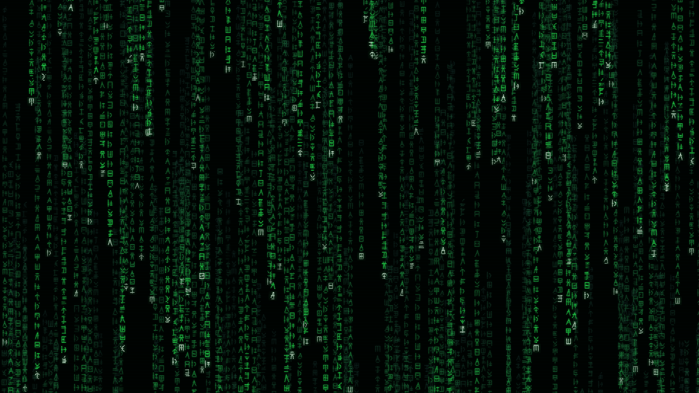

# Glyph Rain 256-glyph partition

This isolated benchmark extends the deterministic Glyph Rain catalog from 192
to **256 unique fictional characters** without changing the flagship
screensaver, its exported 192-character catalog, or any existing result
record.



## Result

The realistic-latency sweep passed at every concurrency: **1,536 validated
tile outputs across six runs, with 256/256 valid PNGs and 256/256 unique
SHA-256 hashes in every run, at $0 API cost.**

| Concurrency | 192 glyphs | 256 glyphs | 256 speedup | 256 throughput |
|---:|---:|---:|---:|---:|
| 1 | 1,149.60 s | 1,516.99 s | 1.00x | 0.169 glyph/s |
| 4 | 285.73 s | 382.10 s | 3.97x | 0.670 glyph/s |
| 8 | 144.20 s | 196.70 s | 7.71x | 1.301 glyph/s |
| 16 | 74.10 s | 101.43 s | 14.96x | 2.524 glyph/s |
| 32 | 40.60 s | 54.67 s | 27.75x | 4.683 glyph/s |
| 64 | 20.45 s | **30.61 s** | **49.56x** | **8.363 glyph/s** |

The workload is 33.3% wider. Through concurrency 32, the 256-glyph run holds
per-glyph throughput within 2.6% of the 192-glyph run. Concurrency 64 remains
the fastest wall-clock result; its 10.9% throughput reduction identifies the
point where local procedural rendering and durable artifact journaling begin
to saturate on this machine.

Raw evidence: [256-glyph result record](../../results/glyph_screensaver_256_offline_realistic.json) ·
[192-glyph result record](../../results/glyph_screensaver_offline_realistic.json)

## Partitioned outputs

- [2048x2048 atlas](assets/glyph-atlas.png) — 16x16, all 256 characters
- [1920x1080 preview](assets/glyph-rain-preview.png)
- [12-frame animated proof](assets/glyph-rain-loop.gif)
- [self-contained HTML example](assets/glyph-rain.html)

The evidence record binds the assembled outputs to SHA-256 receipts. The raw
per-concurrency artifacts remain in the ignored local partition:
`smythe_artifacts/glyph_screensaver/partitions/256_offline_realistic/`.

## Reproduce

```bash
python benchmarks/run_glyph_screensaver.py --glyphs 256 \
  --partition 256_offline_realistic --latency-s 5.8 \
  --concurrencies 1,4,8,16,32,64
```

The explicit partition writes only to:

- `benchmarks/results/glyph_screensaver_256_offline_realistic.json`
- `smythe_artifacts/glyph_screensaver/partitions/256_offline_realistic/`

The original screensaver continues to export exactly the first 192 catalog
entries. The additional characters are benchmark-only until intentionally
promoted into a separate product variant.
