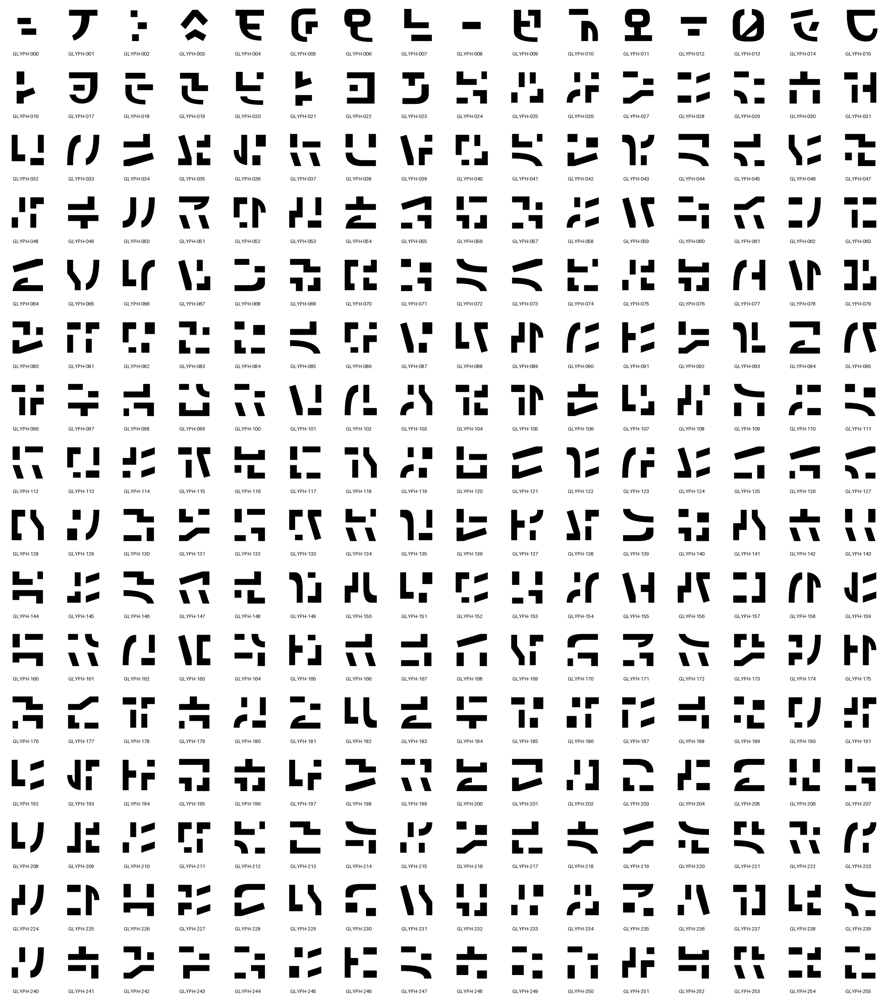

# V2 benchmark catalog: 256 original glyphs

The [full contact sheet](catalog/contact-sheet-128.png) contains the reviewed
192-glyph set followed by 64 additional authored structures, IDs 192–255.
The first 192 SVG files are unchanged, including the approved detached bar in
017. The active screensaver still uses those 192 originals.



[16 px](catalog/contact-sheet-16.png) · [32 px](catalog/contact-sheet-32.png) ·
[64 px](catalog/contact-sheet-64.png) · [Manifest and individual SVGs](catalog/manifest.json).

Enlarged sections: [000–047](catalog/sheet-1.png) · [048–095](catalog/sheet-2.png) ·
[096–143](catalog/sheet-3.png) · [144–191](catalog/sheet-4.png) ·
[192–239](catalog/sheet-5.png) · [240–255](catalog/sheet-6.png).

The extension follows the same broad strokes, straight terminal cuts and
deliberate spacing as the current catalog. The [selection record](selection.json)
retains the 482-candidate pool count and 64 selected structures. All
**32,640 aligned/reflected pairs** pass the 0.85 near-match gate; see
[distinctness](catalog/distinctness.json). These are shape checks, not a
universal-originality or model-quality score.

The [additional contour recipes](contours-extra.json) extend the existing
authoring data. Selection and this labeled review export happen outside the
[measured workflow](../../svg_v2_protocol.md). The experiment compiles geometry,
validates all four sizes, compares every pair, and exports a fresh catalog in
every timed run.

## Reproduce the sheet

```python
from pathlib import Path
from benchmarks.run_svg_v2_benchmark import EXTENDED
from screensaver.glyph_design_v2 import write_study

write_study(Path("smythe_artifacts/my-256-glyph-sheet"), outlines=EXTENDED)
```

Use a new directory. The current 192-glyph viewer is unchanged; this is a
separate benchmark/review set, not a replacement native package.

Style research and the live effect credit [m8e/matrix-rain](https://github.com/m8e/matrix-rain)
and Rezmason. These sheets contain only Smythe's original contours. The
licensed base artwork remains separate with its
[MIT notice and provenance](https://github.com/petehottelet/noumenon/blob/main/svg-preview/reference/README.md).
