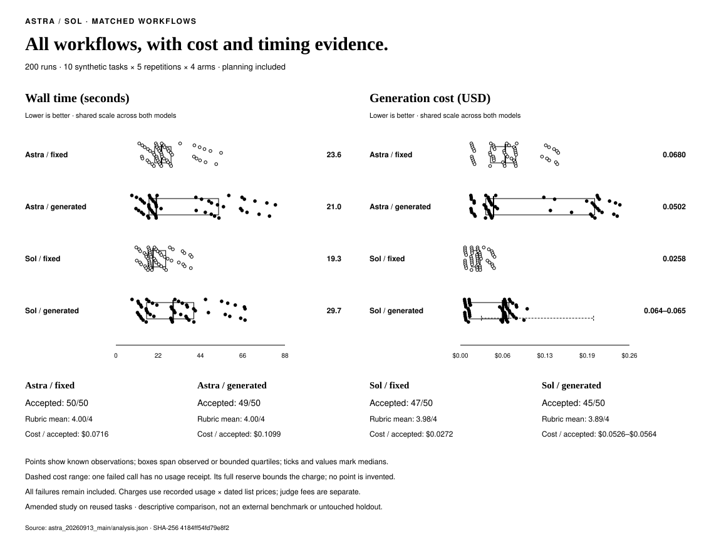
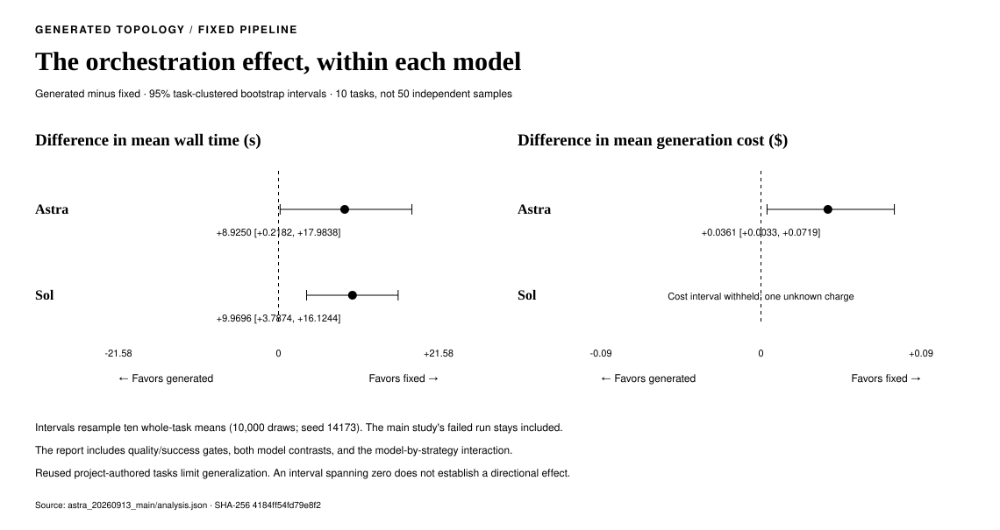

# Astra and Sol: 200 matched workflows

**Evidence status: human review pending; not claimable.**

The frozen automatic checks accept 191/200 workflows. Each run uses GPT-6 Astra or GPT-5.6 Sol
through a fixed research → analysis → writing pipeline or a generated Smythe graph.
The study covers ten synthetic tasks, with five repetitions in every model/strategy cell.

All 200 outcomes and native ledgers are audited. One failed call
has no usage receipt; its full $0.169645 reservation bounds the unresolved charge.
Exact affected cost comparisons remain withheld. [Claim scope and review](review.json).



## Results

| Arm | Accepted | Mean rubric score | Median wall time | P95 wall time | Workflow cost | Cost / accepted |
|---|---:|---:|---:|---:|---:|---:|
| Astra / fixed | 50/50 | 4.00/4 | 23.64 s | 47.85 s | $3.5782200 | $0.0716 |
| Astra / generated | 49/50 | 4.00/4 | 20.95 s | 76.42 s | $5.3826700 | $0.1099 |
| Sol / fixed | 47/50 | 3.98/4 | 19.26 s | 37.23 s | $1.2788070 | $0.0272 |
| Sol / generated | 45/50 | 3.89/4 | 29.68 s | 65.72 s | $2.3679962–$2.5376412 | $0.0526–$0.0564 |

Generated graphs increased mean wall time in both models on this task set.
Astra generated graphs also increased mean generation cost. Their lower median time
does not reverse the mean result: expensive, slower graphs extend the tail.
The paired comparisons below include that variation and the planning overhead.

Every scheduled run remains in the cost and success totals. An automatically accepted answer
passes every deterministic check, every rubric criterion at ≥3/4, and has no material defect.
Missing outputs receive zero rubric score. Judge fees are separate from workflow charges.

Cost ranges run from confirmed generation charges through confirmed charges plus the full held
reservation. They are accounting bounds, not confidence intervals or a claim that the failed call was free.

## Paired comparisons

Negative time or cost differences favor generated graphs. Intervals resample ten
whole-task means, retaining all five repetitions per task. They are descriptive
95% percentile intervals from 10,000 bootstrap draws, seed 14173, without multiplicity adjustment.



| Model | Mean time difference, 95% interval | Mean cost difference, 95% interval | Success gate | Quality gate |
|---|---:|---:|---|---|
| Astra | +8.92 [+0.22, +17.98] s | +0.0361 [+0.0033, +0.0719] USD | Passed | Passed |
| Sol | +9.97 [+3.79, +16.12] s | Withheld: unresolved usage USD | Passed | Passed |

The fixed gates require ≥90% accepted runs in both compared arms and a quality
difference interval whose lower bound is at least −0.25 on the mean anchored 0–4 scale.
A time or cost interval spanning zero does not establish a directional effect.

### Model effect and interaction

| Contrast | Mean wall-time difference, 95% interval | Mean cost difference, 95% interval |
|---|---:|---:|
| Astra − Sol, fixed | +4.96 [+2.23, +7.84] s | +0.0460 [+0.0300, +0.0634] USD |
| Astra − Sol, generated | +3.92 [-1.38, +9.11] s | Withheld: unresolved usage USD |
| Model × strategy interaction | -1.04 [-7.34, +4.89] s | Withheld: unresolved usage USD |

The interaction is (Astra generated − fixed) − (Sol generated − fixed).
The [complete analysis](analysis.json) also retains quality and acceptance contrasts.

## Where the work goes

| Arm | Median nodes (range) | Planning charges | Execution charges | Generation calls by phase |
|---|---:|---:|---:|---|
| Astra / fixed | 3 (3–3) | $0.0000000 | $3.5782200 | execution: 150 |
| Astra / generated | 1 (1–5) | $1.7988675 | $3.5838025 | execution: 114, planning: 50 |
| Sol / fixed | 3 (3–3) | $0.0000000 | $1.2788070 | execution: 150 |
| Sol / generated | 3 (1–5) | $0.6565612 | $1.7114350–$1.8810800 | execution: 140, planning: 50 |

Workflow charges and held exposure reconcile every native phase and attempt.
Token-count requests are retained separately. Valuation multiplies native generation
usage by frozen list prices; it is not an invoice reconciliation.

## Task-by-task results

All five repetitions per arm are included. Times are means in seconds, including
planning and the failed workflow. Node counts are medians from the saved generated graphs.

| Task | Astra fixed → generated | Sol fixed → generated | Generated nodes, Astra / Sol |
|---|---:|---:|---:|
| calendar | 17.45 → 13.43 | 16.38 → 13.29 | 1 / 1 |
| capacity-chain | 21.26 → 19.82 | 17.34 → 17.51 | 1 / 1 |
| delivery-copy | 24.40 → 52.24 | 24.06 → 42.39 | 5 / 4 |
| field-links | 26.96 → 19.73 | 17.20 → 31.64 | 1 / 5 |
| identifiers | 13.59 → 11.95 | 12.75 → 11.39 | 1 / 1 |
| library-hours | 49.57 → 77.35 | 35.37 → 61.48 | 3 / 3 |
| production-chain | 22.22 → 18.63 | 17.24 → 16.87 | 1 / 1 |
| studio-copy | 24.23 → 49.64 | 24.93 → 34.39 | 5 / 4 |
| tunnel-links | 25.81 → 27.98 | 18.32 → 33.63 | 1 / 5 |
| warehouse-routing | 41.99 → 65.98 | 34.28 → 54.97 | 3 / 3 |

These task-level observations apply to the supplied-source tasks and frozen policies above.

## Human review

A human reviewed a balanced pilot sample covering all four arms and the planted-error control.
After blind main judging, all eight disputed available answers were prepared for human review,
with model and strategy labels hidden. Those ratings are separate from the frozen primary rule.
The missing output remains failed; no human score is invented for it.

| Sample | Task | Human score | Human decision | Notes |
|---|---|---:|---|---|
| A–H | Seven capacity-chain answers and one delivery-copy answer | Pending | Pending | No ratings submitted yet |

Human ratings are pending. All eight original
automatic rejections remain in the reported 191/200 primary acceptance count.
Disagreement limits interpretation of judge-based quality differences; this study makes no
quality-superiority claim. Raw answers, judge reasons, pilot human ratings and the
pending main review manifest are available in the evidence archive, with hashes
bound in [the review](review.json).

## Calibration, amendments and spending

Human calibration accepted all five real samples at 4/4 and rejected the planted-error
control at 1/4. Blind Gemini calibration also detected the planted false claims.
The [method amendment](../../astra_method_amendment_20260913.md) retains the input-contract
defects, corrected pilots and stopped main run. None contributes a row to this 200-run comparison.

The amended main study then stopped at workflow 147 on a connection failure before any HTTP
response. The [explicitly approved continuation](../../astra_connection_continuation_20260913.md)
retained that failed outcome and its full reserve, then executed only the remaining 53 entries
in their frozen order. The combined comparison includes the failed row; it was never rerun.

| Stage | Workflows | Workflow charges | Included in main comparison |
|---|---:|---:|---|
| original-pilot | 12 | $0.7805955 | No |
| format-pilot | 12 | $0.6789914 | No |
| amended-pilot | 12 | $0.6192880 | No |
| typed-pilot | 12 | $0.5807450 | No |
| main | 31 | $1.7646655 | No |
| amended-main-prefix | 147 | $8.7856602–$8.9553052 | Yes |
| main-continuation | 53 | $3.8220330 | Yes |

All 279 attempted workflows total **$17.0319786–$17.2016236**.
Judge charges across pilot and main are **$1.9207290–$2.2828260**.
The entire campaign totals **$18.9527076–$19.4844496**,
within the approved $300 ceiling: $60 pilot, $200 main and $40 judging. Stage balances were never transferred.

## Measurement scope

- Exact models: `gpt-6-astra`, `gpt-5.6-sol`; native Responses, Standard/global, medium reasoning,
  8,192 output tokens per call, no tools/search and no SDK retries. Fixed graphs have three stages;
  generated graphs have at most eight execution nodes and concurrency eight, with zero retries/regenerations.
- One workflow at a time on a Windows development host. Heavy tests and media rendering were deferred
  until main timing finished; documentation editing continued. The cloud provider remains shared infrastructure.
- Wall time includes workflow setup, native token quotes, planning, execution and ledger inspection.
  It excludes harness evidence publication and between-trial audits. The failed call has a complete
  observed time to failure. The operational pause before continuation is not workflow latency.
- Gemini sees anonymous task/source/rubric/output inputs. Identical task/output pairs reuse a saved judgment.
  The requested and returned identity is `gemini-3.1-pro-preview`; provider-controlled aliases can change.
  Native totals count reasoning once. Missing cached-input detail produces a bounded price interval.
- This amended study reuses ten project-authored tasks in five related task families. It is not an untouched
  holdout, an external benchmark, a framework comparison, or a measurement of SVG design or screensaver FPS.
  Task-level intervals do not account for shared task-family or provider-session correlation.
- Rubric scores are anchored ordinal judgments. Means summarize the recorded scores; they do not support
  cost-per-score ratios or an unmeasured claim about harder tasks. The control demonstrates detection of its
  planted defects, not sensitivity to every subtle quality difference.

- One missing usage receipt prevents an exact cost value for its workflow and arm. Comparisons touching
  that arm have no exact cost confidence interval. Timing, acceptance and rubric comparisons retain all
  200 outcomes. The analysis also records descriptive bounds for affected mean cost differences.

[Execution protocol and prices](../../astra_benchmark_plan.md) · [Runner commands](../../astra_runtime.md).

## Verification

The full offline suite passed **3,928 tests with 6 skipped**
across 133 files, including 283 Astra checks. Ruff passed.
All repository Python sources matched before and after the run.
[Qualification and source hashes](qualification.json) · [Complete logs and JUnit records](offline-verification.zip).

## Evidence and reproduction

- [All 200 trial metrics, comparisons and phase charges](analysis.json)
- [Native evidence review](review.json) and [all campaign spending](campaign-spending.json)
- [Complete evidence archive](evidence.zip) and [member hashes](archive-manifest.json)
- [Fresh-extraction reproduction](relocated-review.json) and [chart inspection](visual-review.json)
- [Original 24-workflow pilot snapshot](../astra_20260913/README.md)

Archive SHA-256: `110e612ce24805bfc98da8eeabf80d824fdadbebabecf2786bc1fdbdba02a8ff`.

The archive includes every main output, the native SQLite ledgers, frozen sources, judge requests and
responses, pilot human ratings, the pending main review sheet, and diagnostic history. Extract to a new directory; the nested original
pilot archive preserves its earlier snapshot. Inspect without paid calls:

```bash
python -m benchmarks.astra_main_evidence --main-directory EXTRACTED/main --continuation-directory EXTRACTED/main-continuation --judge-directory EXTRACTED/judging --bindings-path EXTRACTED/calibration/main-judgment-bindings.json --source-archive EXTRACTED/sources/typed-main-source.zip --continuation-source-archive EXTRACTED/sources/continuation-source.zip --out NEW_REVIEW_DIRECTORY
```

