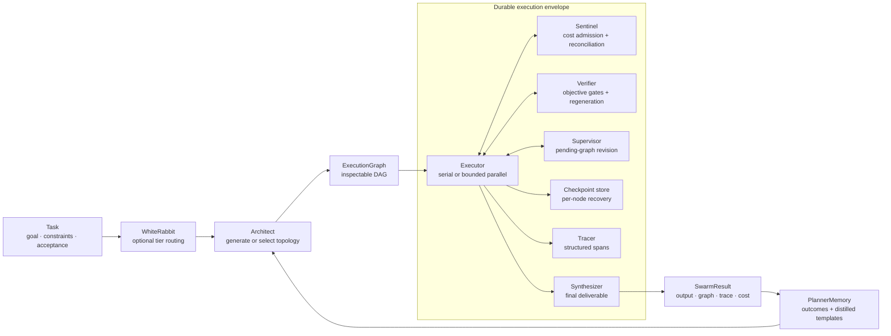

# Architecture

Smythe is organized around two core abstractions: a generated execution graph
and the durable envelope that governs its execution.

## System at a glance

## 1. Generated execution topology

`Task` captures the goal, constraints, context, and acceptance criteria. An
Architect converts it into an `ExecutionGraph`: a validated DAG whose nodes
name concrete work products, dependencies, capabilities, models, failure
policies, timeouts, and optional verification relationships.

Applications can inspect, reject, edit, export, or execute the graph. Planning
never implies execution.

### Planning tiers

| Tier | Class | Decision surface |
|---|---|---|
| Deterministic | `DeterministicArchitect` | Python constructs the exact graph |
| Constrained | `ConstrainedArchitect` | A model selects from approved `SubGraphTemplate` values |
| Autonomous | `LLMArchitect` | A model generates a task-specific graph |

`WhiteRabbit` can route tasks between those tiers. The registry then assigns
nodes to agents by required capabilities, including capabilities hydrated from
external skill inventories.

### Topology vocabulary

- **Serial** for dependent stages.
- **Fork-join** for independent specialist work that must be combined.
- **Broadcast-reduce** for many variants produced from a shared brief.
- **Adversarial** for work that needs a challenge or audit before delivery.

The planning prompt starts from one node and requires each added node to
contribute a distinct work product. That right-sizing policy is what lets the
same system use one node for a transformation and a wide graph for parallel
artifact generation.

## 2. Durable execution envelope

The graph runs through one set of controls regardless of who designed it.

| Component | Responsibility |
|---|---|
| `Executor` / `AsyncExecutor` | Dependency scheduling, failure policies, retries, timeouts, and bounded parallelism |
| `Sentinel` | Reserve cost before dispatch, reconcile completed calls, and stop new work at the ceiling |
| `Tracer` | Record node lifecycle, tool use, revisions, regenerations, and cost metadata |
| `CheckpointStore` | Persist graph, results, agents, task, control counters, and spend for resume |
| `Supervisor` | Review completed results and revise only the unexecuted remainder |
| `Verifier` | Judge a target node and reset its downstream subtree after a failed gate |
| `Synthesizer` | Return the graph's intended deliverable rather than its execution transcript |

### Execution flow

1. Validate the DAG and stamp its model and task context.
2. Admit ready nodes up to `max_concurrency`.
3. Reserve each node's worst-case or estimated cost before provider dispatch.
4. Execute provider and MCP tool calls under node and loop timeouts.
5. Persist results and cost at the configured checkpoint interval.
6. Apply bounded verification or supervision decisions.
7. Synthesize the deliverable and write the terminal checkpoint.

Fatal failures cancel and await active siblings. Queued nodes do not start once
the failure is observed. Completed nodes remain available to a resumed run.

## Artifacts and jobs

Provider responses can include artifacts as well as text. Execution-scoped
artifact stores write bytes atomically and keep hashes in the graph state.
Nodes can receive dependency images as native vision inputs.

The Jobs surface adds a manifest and operator protocol for high-fan-out work:
complete worst-case preflight, approval bound to the exact plan and ceiling,
SQLite attempt/event journaling, explicit unknown outcomes, selective rerolls,
and portable exports. See [Jobs](jobs.md).

## Tools and skills

Agents can carry MCP server specifications. The runtime discovers an allowed
tool set, runs a bounded tool loop, traces every call, and resolves secret
environment variables at execution time without serializing their values.
See [MCP](mcp.md).

Capability hydration influences assignment; MCP tools enable execution. The
Architect receives the effective agent/tool inventory so it can design the
graph around capabilities that actually exist.

## Learning loop

`PlannerMemory` records the task, topology, cost, duration, and outcome of each
completed run and recalls relevant outcomes into later planning prompts.
`distill_template` turns a successful completed graph into a reusable
`SubGraphTemplate`, moving a proven topology from autonomous planning into the
constrained tier.

This keeps learning reviewable: execution history informs future choices, and
promoted graph structure becomes an explicit template rather than an invisible
prompt mutation.

## Public boundaries

- The graph is the planning and inspection boundary.
- The node is the checkpoint, retry, timeout, trace, and budget-accounting boundary.
- The run budget governs execution and synthesis.
- A supervisor may change only pending work.
- A verifier may reset only its target and downstream dependents.
- A resumed run keeps completed results, recorded spend, and consumed control allowances.
