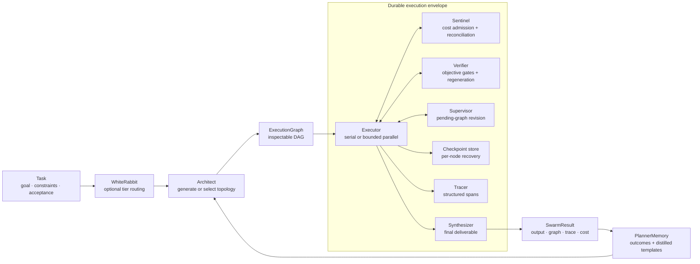

# Architecture

Smythe is organized around two core abstractions: a generated execution graph
and the durable envelope that governs its execution.

## System at a glance

## 1. Generated execution topology

`Task` captures the goal, constraints, context, and acceptance criteria. An
Architect converts it into an `ExecutionGraph`: a validated DAG whose nodes
name concrete work products, dependencies, capabilities, failure policies,
timeouts, and optional verification relationships. Graphs you write in Python
or YAML can also set per-node models and agent tools; generated plans cannot.

Applications can inspect, reject, edit, export, or execute the graph. Planning
never implies execution.

The graph carries a detached `Task` snapshot, preserving source context and
acceptance criteria through inspection, execution, supervision, synthesis,
memory, and resume. [Task handoff semantics](tasks.md).

### Planning tiers

| Tier | Class | Decision surface |
|---|---|---|
| Deterministic | `DeterministicArchitect` | Python constructs the exact graph |
| Constrained | `ConstrainedArchitect` | A model selects from approved `SubGraphTemplate` values |
| Autonomous | `LLMArchitect` | A model generates a task-specific graph |

`WhiteRabbit` can route tasks between those tiers, matching the classifier's
reply without regard to case or surrounding punctuation. The registry then
assigns nodes to agents by required capabilities, including capabilities
hydrated from external skill inventories.

**Changed in 0.8.1:** model output is data. `LLMArchitect` reads a generated
plan under a strict schema (`smythe.loader.build_graph_from_model_output`): a
plan cannot declare MCP servers, commands, URLs, environment variables, or
per-node models, and unknown fields are rejected. Node ids are 1–64 letters,
digits, `-` or `_`; plans are limited to 8 nodes and 5 levels by default
(`LLMArchitect(max_nodes=..., max_depth=...)`), and a node may ask for at most 3
retries and 2 regenerations. A reply that breaks the schema, or that stops at
the output token limit, is retried with the problem named, up to `max_retries`.

**Changed in 0.8.2:** a generated plan may contain at most one gating node,
which must list the node it verifies in `depends_on`, and a generated node
timeout must be at least 60 seconds (`smythe.loader.MODEL_PLAN_MIN_TIMEOUT_S`),
because a timeout cancels provider calls that were already sent. A planning
reply that the provider refused or filtered is retried like a truncated one
([stop reasons](execution.md)). No graph, generated or written by hand, may use
the node id `__synthesis__`, which the synthesizer reserves for its budget and
trace entries.

`ConstrainedArchitect` limits the composed graph to 64 nodes by default
(`ConstrainedArchitect(max_nodes=...)`) and retries a selection over the limit.
Template builders receive model-chosen `params` and must bound them: the limit
is checked when each builder call returns. In a durable run, the LLM and
constrained architects also check each plan against the run's graph policy,
plain-text node rules and journal node-id rule before planning is saved
([durable planning](workflow-accounting.md#freeze-graph-limits)). A durable
run's template builders must return the same nodes, with the same ids, for the
same task and params: resume rebuilds each saved selection, and a repair prompt
can name a node id, so a builder that relies on `Node`'s random default id can
make resume fail with `WorkflowConflictError`.

### Topology vocabulary

- **Serial** for dependent stages.
- **Fork-join** for independent specialist work that must be combined.
- **Broadcast-reduce** for many variants produced from a shared brief.
- **Adversarial** for work that needs a challenge or audit before delivery.

The planning prompt starts from one node and requires each added node to
contribute a distinct work product. That right-sizing policy is what lets the
same system use one node for a transformation and a wide graph for parallel
artifact generation.

**Added in 0.8.0:** `LLMArchitect(planning_instructions="...")` keeps graph-policy
instructions in the planning request and saved recipe. Answer requirements
remain in `Task.constraints`, which reaches every executor.
[Bounded planning example](workflow-accounting.md#freeze-graph-limits).

## 2. Durable execution envelope

The graph runs through one set of controls regardless of who designed it.

| Component | Responsibility |
|---|---|
| `Executor` / `AsyncExecutor` | Dependency scheduling, failure policies, retries, timeouts, and bounded parallelism |
| `Sentinel` | Validate usage, reserve cost before dispatch, reconcile completed calls, and stop new work at the ceiling |
| `Tracer` | Record node lifecycle, tool use, revisions, regenerations, and cost metadata |
| `CheckpointStore` | Persist graph, results, agents, task, control counters, and spend for resume |
| `Supervisor` | Review completed results and revise only the unexecuted remainder |
| `Verifier` | Judge a target node and reset its downstream subtree after a failed gate |
| `Synthesizer` | Return the graph's intended deliverable rather than its execution transcript |

### Execution flow

1. Validate the DAG and stamp its model and task context.
2. Admit ready nodes up to `max_concurrency`.
3. Reserve each node's worst-case or estimated cost before provider dispatch.
4. Execute provider and MCP tool calls under node and loop timeouts.
5. Persist results and cost at the configured checkpoint interval.
6. Apply bounded verification or supervision decisions.
7. Synthesize the deliverable and write the terminal checkpoint.

Both executors stop new work on a terminal failure. The parallel executor also
cancels and awaits active siblings. Completed results and charges remain
available to an explicit resume. See [Execution policies](execution.md).
Verification records pending decisions and regeneration intents before
cancelling affected work. Those control checkpoints bypass node batching;
resume completes them before dispatch or cached-output return.
See [Verification](verifier.md#recovery-and-concurrent-work).

## Artifacts and jobs

Provider responses can include artifacts as well as text. Execution-scoped
artifact stores write bytes atomically and keep hashes in the graph state.
Nodes can receive dependency images as native vision inputs.

The Jobs surface adds a manifest and operator protocol for high-fan-out work:
complete worst-case preflight, approval bound to the exact plan and ceiling,
SQLite attempt/event journaling, explicit unknown outcomes, selective rerolls,
and portable exports. See [Jobs](jobs.md).

## Tools and skills

Agents can carry MCP server specifications. The runtime discovers an allowed
tool set, runs a bounded tool loop, traces every call, and resolves secret
environment variables at execution time without serializing their values.
Servers come only from developer configuration: Python, YAML, or the templates
you write. A generated plan cannot declare one, and resuming a checkpoint
written before 0.8.1 drops its servers. See [MCP](mcp.md).

Capability hydration influences assignment; MCP tools enable execution. The
Architect receives the effective agent/tool inventory so it can design the
graph around capabilities that actually exist.

## Learning loop

`PlannerMemory` records the task, topology, cost, summed node time, and outcome
of each completed run and recalls relevant outcomes into later planning prompts.
Its `total_duration_ms` field sums recorded spans; overlapping nodes contribute
their individual durations, so this value is not elapsed wall time.

**Added in 0.8.0:** recalled topology, success, cost, and duration fields
are validated before ranking. Malformed records are skipped without rewriting
the history file; valid values, legacy keys, and relevance ordering remain
unchanged. Planner prompts label the recorded duration as “Summed node time.”

`distill_template` turns a successful completed graph into a reusable
`SubGraphTemplate`, moving a proven topology from autonomous planning into the
constrained tier.

This keeps learning reviewable: execution history informs future choices, and
promoted graph structure becomes an explicit template rather than an invisible
prompt mutation.

## Public boundaries

- The graph is the planning and inspection boundary.
- Nodes carry retries, timeouts, traces, and cost records. Node results and
  verification control transitions form the checkpoint boundaries.
- Without `run_store`, the ordinary Swarm budget governs execution and synthesis;
  model-based routing, planning, and successful supervision remain outside it.
- With `run_store=SQLiteWorkflowStore(...)`, supported text workflows share one
  durable ledger across routing, planning, execution, verification, supervision,
  and synthesis. Request-bound quotes, fenced dispatch, and retained response
  evidence govern admission and recovery. See [managed scope](workflow-accounting.md#supported-scope).
- A supervisor may change only pending work. It cannot drop a verification
  gate or the node it judges, or leave the gate no longer depending on that
  node; a step it adds after that node is not judged by the gate. One
  `LLMSupervisor` revision may add at most `max_added_nodes` nodes (default 3),
  and a proposal that would leave more than `max_total_added_nodes` (default 8)
  revision-added nodes in the graph is refused.
- A verifier may reset only its target and downstream dependents.
- A resumed run keeps completed results, recorded spend, and consumed control allowances.

The [cost guardrails](budgets.md) reject malformed usage and block unresolved
accounting on resume. Managed accounting does
not expand the supported text-workflow boundary to tools, attachments, or
arbitrary paid custom components; those retain their separate documented scopes.
