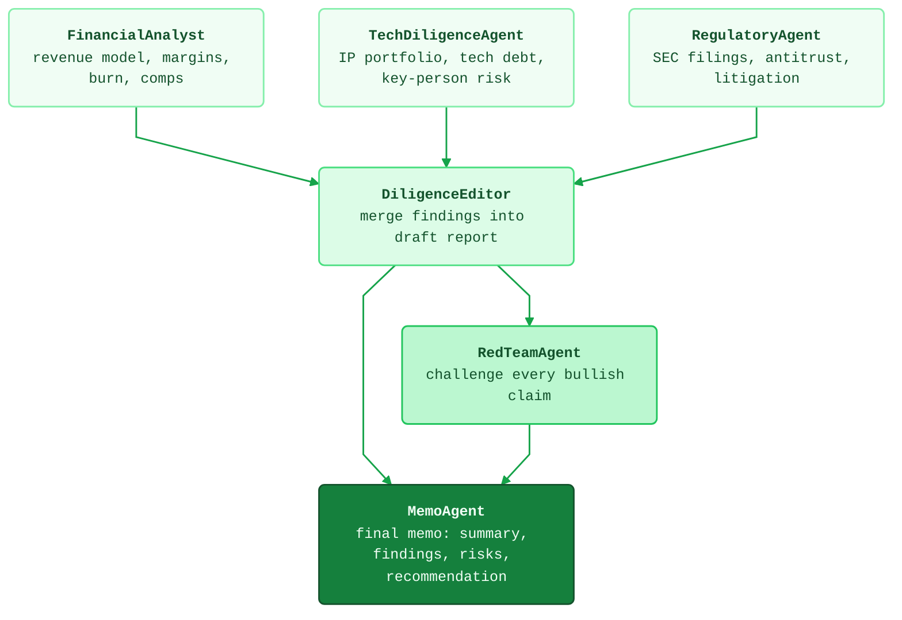

# Flagship demo: acquisition diligence

The showcase from the main README, end to end: you hand the Swarm one
goal — *evaluate whether MetaCortex Corp is a viable acquisition target* —
and the Architect decides the execution topology. Three specialists
fan out in parallel, an editor joins their findings, a red team
attacks the draft, and a memo agent produces the final structured
recommendation.



## Run it

Fixture mode — no keys, no cost, deterministic output:

```bash
python examples/acquisition_diligence/run.py
```

Real mode — set any provider key and the same script has a real model
design and execute the DAG:

```bash
export ANTHROPIC_API_KEY=...   # or OPENAI_API_KEY / GOOGLE_API_KEY
python examples/acquisition_diligence/run.py
```

## What success looks like

The [expected/](expected/) directory holds the committed artifacts
from a fixture run, so you can diff your output against known-good:

| Artifact | What it is |
|---|---|
| [expected/graph.mmd](expected/graph.mmd) | The executed DAG as Mermaid, statuses styled |
| [expected/trace.json](expected/trace.json) | Structured spans for every node execution |
| [expected/memo.md](expected/memo.md) | The final diligence memo |

A test (`tests/test_acquisition_demo.py`) regenerates these from a
fresh fixture run on every CI pass and fails if they drift. Regenerate
them intentionally with:

```bash
python examples/acquisition_diligence/run.py --write-artifacts expected
```

## What this demonstrates

- **Generated topology** — `fork-join → adversarial → serial` comes
  from the Architect, not from pipeline code you wrote.
- **Adversarial review as a graph tier** — the red team is a node with
  a dependency edge, not a prompt suffix. Its findings are inputs to
  the memo node.
- **Plan-before-execute** — `swarm.plan(task)` returns the graph for
  inspection; nothing runs until you call `swarm.execute(graph)`.
- **Parallel execution under a budget** — the three specialists run
  concurrently, budget-capped at $2.00 with per-node cost accounting.

All company details in the fixtures are fictional.
